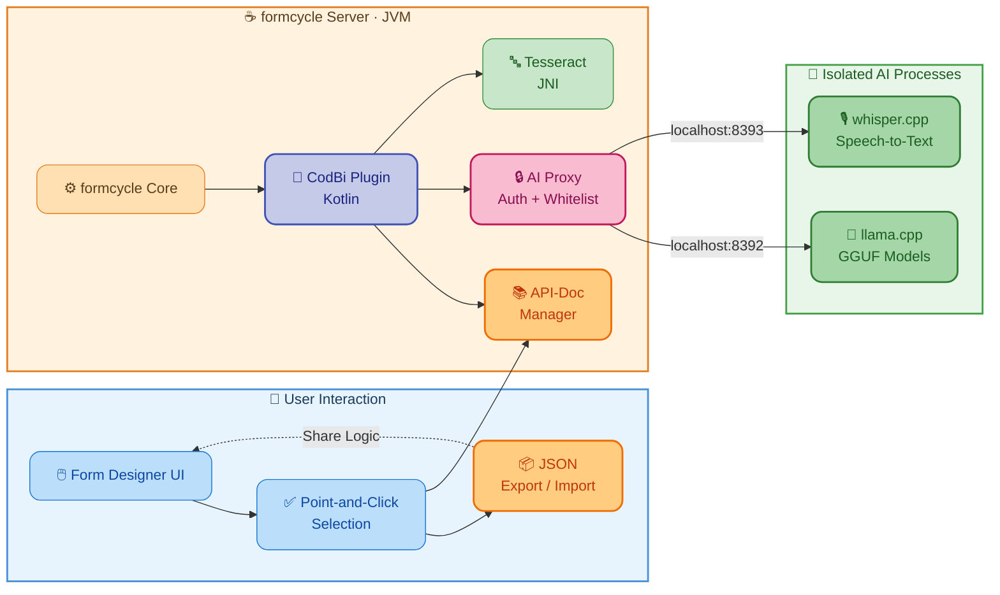

[](LICENSE)
[](https://www.xima.de/formcycle/)
[](https://adoptopenjdk.net/)
[](https://kotlinlang.org/)
[](https://www.typescriptlang.org/)
[](https://code.visualstudio.com/)
[](https://www.jetbrains.com/idea/)

# Code Library (CodBi)

**Low-Code Logic Engine for formcycle & Privacy-First Local AI**

A [XIMA formcycle](https://www.xima.de/formcycle/) plugin that provides a comprehensive JavaScript library of Functionalities, Element Placeholders (EPs), and Standard Configurations for web forms.

CodBi seamlessly integrates AI-powered features (document validation, data extraction, OCR, Speech-To-Text, and AI-Chat). All AI engines are automatically downloaded and configured on first use, with the LLM chat engine supporting any GGUF-compatible model. Additionally, the built-in Local API-Documentation Manager allows users to define, manage, and share custom CodBi elements across all forms on a server, treating them exactly like built-in features.

> **Architectural Vision:** CodBi is a framework that empowers form designers to define complex logic without coding — by composing ready-made CodBi elements — and enables developers to create, share, and reuse those building blocks across the community, growing the library with every contribution. At the same time, it eliminates the trade-off between AI capability and DSGVO/GDPR compliance by running high-class models like Qwen, Mistral, LLaMA 3, Phi-3, and Gemma locally on the server via llama.cpp, alongside Whisper for speech-to-text and Tesseract for OCR — so sensitive citizen data never leaves your infrastructure.


### 🚀 Key Highlights

- **Modular by Design** — Functionalities and EPs are composable building blocks: mix and combine them freely to build a wide range of applications — from simple input masks to AI-powered document processing pipelines — without writing custom code.
- **Empowering Collaboration** — Export and import complete CodBi elements as JSON — including executable code, description, parameter definitions, global variables and targeted CSS classes. This fosters knowledge sharing across departments and formcycle instances, allowing teams to benefit from pre-validated solutions.
- **Intelligent Designer Integration** — The built-in Manager provides a seamless UI where users select elements — both built-in and custom — via point-and-click or autocomplete instead of manual typing, drastically reducing errors and lowering the entry barrier for creating smart forms.
- **Local API-Documentation Manager** — Define, document and manage custom CodBi elements directly in the form designer — complete with code, parameters, global variables and CSS classes. Elements can be authored in JavaScript or TypeScript; for TypeScript, the [`codbi-elements-template`](https://github.com/XIMA-formcycle-Entwicklerkreis/CodBi-Elements-Template) project automatically generates the importable JSON. Custom elements behave identically to built-in ones and are available across all forms and in the intelligent designer interface.
- **Flexible AI Integration** — CodBi can expose its AI engines via ChatML (AIproxy) for external access, attach to external AI endpoints, and—using the specialist parameter—mix and orchestrate both local and external AI models within the same workflow.
- **On-Premises AI Stack** — Through llama.cpp's GGUF support, high-class models like Qwen, Mistral, LLaMA 3, Phi-3, and Gemma become available for local inference. Combined with local speech-to-text via whisper.cpp (GGML) and local OCR via Tesseract (JNI), the entire AI stack runs on-premises — no unwanted external cloud dependencies.
- **Accurate Date Reasoning** — CodBi's system prompt injects real-time calendar context (current date, weekday, days in month) and guides even small local models to calculate dates correctly through structured chain-of-thought reasoning — no cloud API required.
- **Hardware Optimized** — Native support for Vulkan and CUDA 12, with automatic CPU fallback.
- **Zero-Config Deployment** — Automatic downloading and configuration of binaries and models on first use.
- **Efficient Loading** — The code that constitutes a CodBi-Element is only loaded into a form when actually used, keeping page weight minimal.

## 📥 Installation

Install the plugin via the plugin menu in the formcycle backend as system-scoped plugin.

This adds several settings to the form designer within the `form` tab (the properties panel on the right-hand side), including the ability to enable CodBi, select the configuration template `default` (`xtensible` is for future use), and manage Standard Configurations.

### 📖 Interactive Onboarding Guide

An interactive onboarding form is available at **[CodBi OnBoarding](https://forms.ansbach.de/frontend-server/form/alias/1/CodBi_OnBoarding/)** — it walks you through configuration, AI setup, and DSGVO/GDPR compliance step by step.

## 🛠 Features

### ⚡ Functionalities

Functionalities are applied to HTML elements via `data-cb-func` attributes. They transform, validate, or enhance form elements at runtime.

| Category | Element | Description |
|---|---|---|
| **AI / ML** | `AI.Llama.Chat` | Multi-turn chat with local LLaMA — image/PDF attachments, Brave Search, geolocation, voice input (Whisper), chain-of-thought reasoning |
| | `AI.Llama.Standard.QA` | Image/PDF Q&A — auto-triggers on upload, extracts answers from scanned documents, supports verification mode. <br>**Parameters:** Enable Brave Search (internet), use `specialist` to select any configured AI (local or external), and mix local/external AIs in one workflow. |
| | `AI.Llama.Standard.TxtQA` | Text-based Q&A — auto-triggers on field change, debounced inference with optional web search. <br>**Parameters:** Enable Brave Search (internet), use `specialist` to select any configured AI (local or external), and mix local/external AIs in one workflow. |
| | `AI.OCR` | Tesseract OCR — print, verify, and extract-fields modes with regex-based structured extraction and auto-orientation detection |
| **Date / Time** | `Date.Frame` | Connects two date inputs (min/max validation) |
| | `Date.Min` | Forces minimum date validation |
| | `Date.NoWeekends` | Prevents weekend selection in date inputs |
| | `Time.Frame` | Connects two time inputs for min/max validation |
| **Input Transformations** | `HTML.Input.Transformer` | Base transformer for input value modifications |
| | `HTML.Input.Trans.Capital` | Capitalizes input text |
| | `HTML.Input.Trans.NTW` | Converts numbers to words with dashes |
| | `HTML.Input.Trans.Regex` | Applies regex-based transformations |
| | `HTML.Input.Cleave` | Advanced input masking (Cleave.js) |
| | `HTML.Input.Regex` | Validates input against regex patterns |
| | `HTML.Input.Blacklist` | Prevents blacklisted values |
| | `HTML.Input.NoAutocomplete` | Disables autocomplete on inputs |
| **HTML / DOM** | `HTML.CSS` | Injects CSS with placeholder replacements |
| | `HTML.Panel` | Creates panel structures with advanced layout |
| | `HTML.Panel.Accordion` | Groups panels into accordion sets |
| | `HTML.Select.Favorites` | Rearranges select options with favorites on top |
| | `HTML.Select.Injection` | Dynamically populates select dropdowns |
| | `HTML.SetAttribute` | Sets HTML attributes dynamically |
| | `HTML.Text.Injector` | Injects text with placeholder replacement |
| | `HTML.Text.Mapper` | Maps object properties to text placeholders |
| **Media** | `Media.Image.Cropper` | Image cropping |
| | `Media.Input.Speech` | Browser Web Speech API (Chrome/Edge) — cloud-based, requires DSGVO consent |
| | `Media.Input.Speech.Whisper` | Local speech-to-text via whisper.cpp — fully on-premises, DSGVO-compliant, auto-download of models |
| | `Media.MultipleUpload` | Multiple file upload support |
| **Integrations** | `LDAP.Autocomplete` | LDAP-based autocomplete for inputs |
| | `LDAP.Autocomplete.Set` | Multi-field LDAP autofill coordination |
| | `OpenPLZ.Autocomplete` | German postal code autocomplete |
| | `Matomo.Tracking` | Web analytics integration |
| **Utility** | `JSON.Set` | Sets properties in JSON objects |
| | `Form.Navigator` | Form navigation buttons and synchronization |
| | `OnChange.Conditional` | Conditional functionality execution |
| | `Print.Remove` | Controls print-related content removal |
| | `Sys.Log.Console` | Console logging (for testing purposes)|

### 🔗 Element Placeholders (EPs)

EPs (Element Placeholders) can be used in any functionality parameter to dynamically retrieve values—whether for Functionalities, Standard Configurations, or custom logic. This enables powerful, reusable code patterns: parameters can reference EPs to fetch data from the DOM, global variables, external services, or computed values, all without hardcoding. You can also define EPs locally, making parameterization flexible and context-aware—so the same functionality can adapt to different forms or user inputs simply by changing the EP reference, not the code itself.

| Category | Element | Description |
|---|---|---|
| **Core** | `F` | Find objects in arrays by property/value |
| | `I` | Get element at specific array index |
| | `V` | Access global variables |
| | `Unique` | Remove duplicates from arrays |
| | `Sorted` | Sort arrays alphabetically |
| **Data** | `Data.CSV` | Convert CSV strings to arrays |
| | `Data.Join` | Merge multiple objects into one |
| | `JSON.Path` | Retrieve objects at specific JSON paths |
| | `DOM.Query` | Query DOM elements by CSS selector |
| | `Net.URL` | Fetch content from URLs |
| **Date / Time** | `Date.Today` | Current date with arithmetic (+/-d/m/y) |
| | `Date.FromString` | Convert strings to Date objects |
| | `Date.Arithmetic` | Apply date arithmetic operations |
| | `Date.Holidays` | German holidays by state (API-Feiertage.de) |
| | `Date.Weekends` | Generate weekend date ranges |
| **External Services** | `AI.Llama.Std.QA` | AI Q&A EP — returns AI answer as a Promise, supports internet/geolocation/JSON parsing |
| | `OpenPLZ` | German postal code / administrative data |
| | `OpenPLZ.Localities` | OpenPLZ localities |
| | `OpenPLZ.OrganizationalUnits` | OpenPLZ organizations |
| | `OpenPLZ.Streets` | OpenPLZ street data |
| | `OpenPLZ.TextSearch` | OpenPLZ text search |
| | `LDAP.Find` | LDAP directory queries |
| **BayVIS** | `BayVIS.Ansprechpartner` | Authority (**BayernPortal**) directory contacts |
| | `BayVIS.Ansprechpartner.ID` | Contact by ID |
| | `BayVIS.Behoerden` | Authorities/agencies |
| | `BayVIS.Behoerden.ID` | Authority by ID |
| | `BayVIS.Behoerden.Details` | Authority details |
| | `BayVIS.Behoerden.Details.Gebaeude` | Building details |
| | `BayVIS.Behoerden.Gebaeude.ID` | Building by ID |


### 📋 Standard Configurations

Pre-built configurations that wire together Functionalities and EPs for common use cases. These can also be defined and managed locally via the **Local API-Documentation Manager** in the form designer. Holistic standard configurations apply to the entire form thus just requiring the single activation click.

| Category         | Configuration Name         | Description |
|------------------|---------------------------|-------------|
| **AI**           | AI                        | Bundles AI-powered features (chat, Q&A, extraction, validation) for easy integration. |
| **Appointments** | Appointments              | Handles appointment booking, validation, and related workflows. |
| **BayVIS**       | BayVIS                    | Integrates Bavarian authority directory data and lookups. |
| **Financial**    | Financial                 | Provides financial data entry, validation, and calculations. |
| **People**       | People                    | Manages person-related data, validation, and lookups. |
| **OpenPLZ**      | OpenPLZ Autocomplete Sets | German postal code and address autocomplete and lookup. |
| **LDAP**         | LDAP Autofill             | Autofills form fields using LDAP directory data. |
| **UI**           | UI Panels                 | Predefined UI panel layouts and grouping for forms. |
| **Utility**      | Print Removal             | Removes or hides elements for print-friendly output. |
| **CSS**          | Holistic CSS Standards    | Applies consistent, organization-wide CSS styling. |
| **Input Masking**| Holistic Cleave input masks        | Input masks for dates, phone numbers, postal codes, and times. |
| **Fieldsets**    | Holistic Fieldsets-to-Panel        | Converts fieldsets into advanced panel layouts. |
| **Analytics**    | Holistic Matomo Tracking           | Integrates Matomo analytics for form usage tracking. |
| **Speech**       | Holistic Speech Input              | Adds Speech-To-Text input (standard and Whisper-based). |

### 📚 Local API-Documentation Manager

The heart of CodBi's code sharing mechanism. An integrated Angular component in the form designer that lets you create and manage your own CodBi elements (Functionalities, EPs, Standard Configurations) locally — without touching the plugin source code. Custom elements registered through the Manager behave identically to the built-in ones: they appear in the same UI, support the same `data-cb-func` attributes, and are executed by the same runtime.

- **Visual Selection** — Browse and search all available elements; select them via point-and-click instead of typing technical names, eliminating typo-related errors
- **Define Custom Logic** — Create and document your own elements with parameters and executable code directly in the browser
- **Logic Portability** — Export validated form logic as JSON and import it on other formcycle instances or share it with the community, avoiding redundant development
- **Synchronization** — Keep local definitions in sync with the formcycle backend (use `APIDoc_UsersAllowedToSYNC` to define who may sync)

### 📐 CodBi Elements Template

A ready-to-use TypeScript project template ([`codbi-elements-template`](https://github.com/XIMA-formcycle-Entwicklerkreis/CodBi-Elements-Template)) for building custom CodBi elements in TypeScript. Includes esbuild bundling, TSDoc-to-JSON generation, and example elements.

### 🧠 AI

CodBi ships a full local AI inference stack that runs entirely on the formcycle server — no cloud services, no data transfer, simplified DSGVO/GDPR scope.

#### 🏗 System Architecture



All AI engines run as **separate OS processes** (LLaMA, Whisper) or **in-process via JNI** (Tesseract), communicating over `localhost`. This design provides:

- **Crash isolation** — if a model runs out of RAM, the OS kills the child process while the Tomcat JVM stays unaffected.
- **Zero-config deployment** — on first use, CodBi downloads the required binaries and model files automatically (with resume support). No manual installation required beyond enabling the plugin. <br>**Note:** The necessary domains must be whitelisted for the setup process to succeed. The ktdoc documentation in the Kotlin source files lists all required domains to whitelist. <br>**Caution:** Virus scanners that monitor the plugin directory or download locations may interfere with the setup, as executable files (such as .dll and other binaries) are downloaded and extracted automatically.
- **Hardware acceleration** — native support for **Vulkan** (cross-platform, default on Windows) and **CUDA 12** (NVIDIA GPUs), with automatic CPU fallback.
- **Resource gating** — a semaphore limits concurrent inferences (default: 2). Excess requests enter a queue; setting a certain parameter, the UI displays the caller's queue position and estimated wait time. 
- **Health monitoring** — periodic health-checks detect when an engine goes offline; the UI reacts immediately and retries automatically on recovery.

#### ⚙️ Automatic Setup

| Component | Downloaded From | Default Asset |
|---|---|---|
| **llama.cpp** | GitHub Releases (`ggml-org/llama.cpp`) | Release `b8175`, Vulkan backend |
| **Whisper (whisper.cpp)** | GitHub Releases (`ggerganov/whisper.cpp`) | Release `v1.7.6`, `ggml-small` model (~466 MB) |
| **QWEN3-VL 2B** (LLM) | Bundled / HuggingFace | `Qwen3VL-2B-Instruct-Q4_K_M.gguf` + multimodal projection |
| **Tesseract** | Maven (tess4j) | In-process JNI, thread-pooled handles |

The default LLM is configured as a convenience, but **any GGUF-compatible model can be used** for the chat / Q&A engine configuring the proper URLs. Through llama.cpp's GGUF ecosystem, high-class models like Qwen, Mistral, LLaMA 3, Phi-3, and Gemma become available for local use, letting you choose larger, domain-specific, or multilingual models depending on your hardware and use case. Whisper uses GGML-format models, and Tesseract uses its own traineddata files — both are downloaded automatically.

#### 📄 Extraction

- **OCR (Tesseract)** — three modes:
  - **Print**: Extract all text from uploaded images or scanned PDFs.
  - **Extract Fields**: Use named regex groups (`Pattern_FieldName`) to extract structured data (e.g., name, date, amount) into separate form fields.
  - **Verify**: Check if the extracted text matches a regex pattern; show an error if it doesn't.
  - Automatic orientation detection (Tesseract OSD), optional image preprocessing (grayscale, binarization, denoising), and DPI-aware recognition.
- **Image / PDF Q&A (LLaMA)** — upload an image or PDF and ask free-form questions. The vision-language model (QWEN3-VL) reads the document and returns answers. Scanned PDFs are rendered to images; text-based PDFs have their text extracted client-side (for Tesseract) or are turned into an image for LLMs.
- **Speech-to-Text (Whisper)** — rather than relying on the experimental and privacy-questionable Web Speech API built into browsers, the CodBi library offers its own robust inference pipeline via Whisper. Record audio in the browser and receive a transcription. Supports interim (partial) results while speaking, auto-language detection, and a configurable hotkey (Default:`Alt+A`).

#### ✅ Validation

- **OCR Verify mode** — validates that an uploaded file matches expected content (e.g., "Does this contain an IBAN?" by applying proper regular expressions). Displays a configurable error message on mismatch and optionally shows a manual-verification checkbox.
- **LLaMA Standard QA Verify mode** — sends the uploaded image to the AI with a verification question. If the answer does not pass, the upload is rejected with a configurable error text.
- **AI attribution label** — `AI.Llama.Standard.QA` and `AI.Llama.Standard.TxtQA` display an `✨ AI-Generated` hint (configurable via `AIHint`) on AI-produced answers, satisfying EU AI Act transparency requirements.

#### 🔒 Privacy & DSGVO/GDPR Compliance

| Feature | Processing Location | DSGVO-Compliant | External Calls |
|---|---|---|---|
| `AI.Llama.Chat` | Local server | ✅ Yes | Brave Search (opt-in) |
| `AI.Llama.Standard.QA` | Local server | ✅ Yes | Brave Search (opt-in) |
| `AI.Llama.Standard.TxtQA` | Local server | ✅ Yes | Brave Search (opt-in) |
| `AI.OCR` | Local server (JNI) | ✅ Yes | None |
| `Media.Input.Speech.Whisper` | Local server | ✅ Yes | None |
| `Media.Input.Speech` | Cloud (Google/MS) | ⚠️ Needs consent | Google / Microsoft |

> **Note on virtualized environments (Media.Input.Speech only):** When using in-browser audio APIs under virtualization layers such as WSLg, browsers do not behave identically. Google Chrome supports hardware passthrough natively and reliably. Microsoft Edge (due to differing sandbox policies) and Firefox (due to package containers and strict privacy restrictions on the Web Speech API) may require manual configuration or fallbacks. This does not affect `Media.Input.Speech.Whisper`, which uses the standard `getUserMedia()` API for raw audio capture and processes speech on the local server.

Key compliance properties:

- **No data leaves the server** for LLaMA, Whisper, and Tesseract — all inference is `localhost`-only (unless an external AI to use is specified or BraveAPI-Search is enabled).
- **AI Proxy** with IP whitelist and HTTP Basic Auth gates external access to the AI endpoints. All requests are logged to a database table with anonymised credentials (SHA-256) and truncated IPs.
- **No separate server infrastructure** — the entire AI stack runs on the same machine as formcycle.
- **Image caching** uses server-side temporary storage with automatic expiration (default: 600 s) and a janitor thread. Caching is only used on images that're uploaded along with a cache-id. Otherwise the images are kept in RAM only.

#### ⚙️ Configuration

AI features are activated via formcycle plugin properties:

| Property | Default | Description |
|---|---|---|
| `Active_AI` | — | Space-separated list of engines to enable (e.g., `llama_engine`) |
| `AI_LLAMA_ENGINE_Port` | `8392` | Local port for the LLaMA server |
| `AI_LLAMA_ENGINE_Threads` | Physical cores | CPU threads for inference |
| `AI_LLAMA_ENGINE_CtxSize` | `32768` | Context window size (tokens) |
| `AI_LLAMA_ENGINE_GpuLayers` | `-1` (auto) | Number of layers offloaded to GPU (`-1` = all, `0` = CPU only) |
| `AI_LLAMA_ENGINE_MaxConcurrent` | `2` | Maximum parallel inferences |
| `AI_Proxy_AllowedIPs` | — | CIDR/IP whitelist for the AI proxy |
| `AI_Proxy_Users` | — | HTTP Basic Auth credentials for external proxy access |

#### 🌐 Network Requirements

If the server has outbound internet access, CodBi downloads models and binaries automatically. Whitelist these domains:

- `github.com`, `objects.githubusercontent.com` — llama.cpp and whisper.cpp releases
- `huggingface.co` — Whisper GGML models
- `api.search.brave.com` — Brave Search API (only if internet search is enabled)

#### 🔌 Air-Gapped / Offline Deployment

For environments without outbound internet access, you can pre-place all required files manually. The plugin checks for existing files before attempting any download.

**Directory structure** (relative to the plugin's data directory):

| Component | Files to place | Directory |
|-----------|---------------|-----------|
| **LLaMA binaries** | Archive (ZIP/tar.gz) + `release-tag.txt` + `gpu-backend.txt` | `ai/llama_engine/bin/` |
| **LLaMA model** | `.gguf` model + multimodal projection (if applicable) | `ai/llama_engine/models/` |
| **Whisper binaries** | Archive (ZIP/tar.gz) | `ai/whisper/bin/` |
| **Whisper model** | `.ggml` model file | `ai/whisper/models/` |
| **Tesseract models** | `.traineddata` files | `Resources/AI/Tesseract/Models/` |
| **Tesseract native libs** | Platform DLLs/SOs | `Resources/AI/Tesseract/Runtime/{platform}/` |

**Marker files:** For LLaMA and Whisper, the plugin requires a `.complete` marker file (can be empty) next to each archive and model file. Without the marker, the plugin assumes the file is incomplete and attempts to re-download. Example:

```
ai/llama_engine/models/Qwen3VL-2B-Instruct-Q4_K_M.gguf
ai/llama_engine/models/Qwen3VL-2B-Instruct-Q4_K_M.gguf.complete   ← marker
ai/llama_engine/bin/release-tag.txt                                 ← e.g. "b8175"
ai/llama_engine/bin/gpu-backend.txt                                 ← e.g. "VULKAN", "CUDA", or "NONE"
```

**Tesseract** does not require marker files — just place the `.traineddata` and native library files directly.

> **Tip:** The KDoc comments in the Kotlin source files document the exact download URLs and expected file names for each component.

## 🌍 Localization

The plugin ships with German and English. You can customize localized messages via I18N variables in the backend (`Files & templates` → `I18N variables`).

| I18N Key | Description |
|---|---|
| `plugin.form_designer_resource.name` | Designer resource display name |
| `plugin.form_designer_resource.desc` | Designer resource description |
| `plugin.form_properties_extension.name` | Form properties extension name |
| `plugin.form_properties_extension.desc` | Form properties extension description |
| `plugin.form_render_callback.name` | Form render callback name |
| `plugin.form_render_callback.desc` | Form render callback description |
| `plugin.form_resources.name` | Frontend resources name |
| `plugin.form_resources.desc` | Frontend resources description |
| `designer.category.codbi_panel` | CodBi designer category label |
| `designer.property.enable_codbi` | Enable CodBi toggle label |
| `designer.property.standards` | Standard Configurations property label |
| `designer.property.config_template` | Config template selector label |
| `designer.property.config_template.option.default` | Default template option label |
| `designer.property.config_template.option.xtensible` | XTensible template option label |

## ➕ Adding New Configuration Templates

To add a new configuration template for the code library that the user can select in the form designer:

* Open `src/main/resources/com/github/xima_formcycle_entwicklerkreis/fc/plugin/codbi/codbi-config-template.properties`
  and add a new line with the technical name of the template.
* Open each `src/main/resources/com/github/xima_formcycle_entwicklerkreis/fc/plugin/codbi/i18n_*.properties` and
  add a localized string for the new template for each language. (The key should be called
  `designer.property.config_template.option.NAME`).
* Add a TypeScript file with the contents of the template in
  `src/main/web/packages/form/src/index-config-template-NAME.ts`

Note: The __technical name must contain only letters, numbers, and dashes__ (0-9, a-z, A-Z, -).

## 💻 Development

This is a [Maven](https://maven.apache.org/) project that requires Maven to build. It also uses
[yarn](https://yarnpkg.com/) for the frontend resources. You do not need to install yarn or node.js, the
[frontend-maven-plugin](https://github.com/eirslett/frontend-maven-plugin) automatically downloads and installs the
required tools locally.

> The following assumes you are using Linux or macOS. For Windows, substitute `./mvnw` with `mvnw.cmd`.
> 

### 🔨 Build

See also the IDE section below. To build the plugin via the command line:

```shell
./mvnw clean package
```

For quick builds with non-minified resources and no tests, use:

```shell
./mvnw package -P dev
```

To start a formcycle server (on port 8080 if free) with the plugin, use:

```shell
./mvnw fc-server:run-ms-war
```

Then open [http://localhost:8080/xima-formcycle](http://localhost:8080/xima-formcycle) in your browser. The default
username and password are `sadmin / admin`.

To build and upload the plugin to the locally running formcycle server:

```shell
./mvnw -P dev fc-deploy:deploy 
```

(If port 8080 was not free, the server will have started on another free port such as 8081. In this case,
you need to add `-DfcDeployUrl=http://localhost:PORT/xima-formcycle` to the command.)

### 🧪 Test

Tests are run automatically during the build. To run the tests explicitly:

```shell
./mvnw test
```

To run the frontend tests explicitly via Jest for a particular package:

```shell
cd src/main/web/packages/form
yarn test
```

### 🖥 IDE

For common IDEs, there are some configurations in the `ide` folder. These are pre-configured settings for VSCode,
IntelliJ, and Eclipse.

* __Eclipse__ Several launch configurations, e.g. for starting a formcycle server with the plugin installed, and to
  upload the plugin to a running server.
  * You may need to install the [Enhanced Kotlin for Eclipse](https://github.com/bvfalcon/kotlin-eclipse-2024).
  * Eclipse does not support [Maven Wrapper](https://maven.apache.org/wrapper/). You may need to `-Denforcer.skip` when
    you see the build fail due to the wrong Maven version getting used.
* __IntelliJ__ Several run configurations, e.g. for starting a formcycle server with the plugin installed, and to upload
  the plugin to a running server.
  * Make sure you also set the default encoding for Java properties files to UTF-8, see `Editor` -> `File Encodings`
    -> `Default encoding for properties files`. 
  * To regenerate auto generated resources, open the Maven window and click on the regenerate button in the toolbar at
    the top.
* __Visual Studio Code__ A workspace file with all workspaces configured. Just go to `File` ->
  `Open Workspace from File` and select file in the `ide/vscode` folder.
  * The workspace also contains a few extension recommendations that you should install.
  * When you first open a TypeScript file, the IDE will ask for permission, click on `Allow` to enable TypeScript
    support.

We recommend IntelliJ for the backend Kotlin code and Visual Studio Code for the frontend CSS + TypeScript code.

Note: There are some auto-generated files, such as
`target/generated-sources/com/github/xima/xima_formcycle_entwicklerkreis/fc/plugin/codbi/EMessageKey.kt`.
If you are using IntelliJ, you may need to press the `Generate Sources` button at the top of the Maven window.

### 🐛 Debugging

For the server-side Kotlin code: You can attach to the JVM process via any remote debugging tool of your choice. When
you start the formcycle server  via the IDE in debugging mode, you should be able to simply set a breakpoint anywhere in
the JVM code.

For the client-side TypeScript code: You can use the browser's developer tools to debug the code. If you built the
plugin with the `dev` profile, the transpiled JavaScript file will contain an inline source map that lets your browser
show you the original TypeScript code in the debugger.

### 🎨 Code Style / Formatting

We use [spotless](https://github.com/diffplug/spotless/blob/main/plugin-maven/README.md) to format all code. There's
also a git hook that's installed automatically and formats code upon commit. If you want to format the code manually,
you can run:

```shell
./mvnw spotless:apply
```

This will format all code in the project.

Note: For Kotlin, this uses [ktfmt](https://facebook.github.io/ktfmt/). They have a plugin for IntelliJ. If you use it,
just leave the code style to the default value `Meta`.  For CSS and TypeScript, this uses [biome](https://biomejs.dev/).
They have an extension for Visual Studio Code.

### 📁 Project Structure

**Code generation**

The folder `src/main/resources/com/github/xima_formcycle_entwicklerkreis/fc/plugin/codbi/`
contains several properties files:

* `constants.properties` - Constant strings that are used in the Kotlin and TypeScript code. For example, contains
  the technical names of the additional properties available in the form designer. 
* `i18n_*.properties` - Localized strings for the Kotlin and TypeScript code.
* `codbi-config-template.properties` - List of available configuration templates for the code library. The key is an
  arbitrary identifier, the value is used to identify the template. Usually key is equal to the value.

These are needed by both the Kotlin and TypeScript code. To ensure consistency, the Maven build generates Kotlin files
and TypeScript files from these properties files. To generate these files manually, run the `generate-sources` Maven
goal.

```shell
./mvnw generate-sources
```

Your IDE of choice may do this automatically, or may  have a button to do this.

**Backend (Kotlin)**

The backend code uses Kotlin, with Maven as a package manager. All code resides in the package
`com.github.xima_formcycle_entwicklerkreis.fc.plugin.codbi`.

**Frontend (CSS + TypeScript)**

The frontend CSS and TypeScript resources are in the `src/main/web` folder. It uses [Yarn Berry](https://yarnpkg.com/)
as the package manager, with [PnP](https://yarnpkg.com/features/pnp) enabled. The project consist of the root package
and 3 sub packages in the `packages` folder. Each package is also a separate Yarn workspace:

* `packages/common` - Common code needed by the other 2 packages.
* `packages/designer` - Code for the form designer, e.g. to add new properties to the form designer.
* `packages/form` - Code for the web form, i.e. the actual code library, such as additional validator functions etc.

We use TypeScript to ensure the code is consistent and conforms to the formcycle API. Formcycle provides packages that
contain the types for the form designer API (`@de-xima/fc-form-designer`) and the web form API
(`@de-xima/fc-form-renderer`).

For simplicity, we use plain CSS (no preprocessor such as SASS), but allow recent CSS features such as
[nesting](https://developer.mozilla.org/en-US/docs/Web/CSS/CSS_nesting). The CSS gets processed by
[postcss](https://postcss.org/) during the build to be compatible with older browsers.

Unit tests use [Jest](https://jestjs.io/).

## 📄 [API Documentation](https://codbi.pages.dev)

### 🌐 Automated Documentation Translation / BYOK

The `scripts/generate-docs.ps1` pipeline automatically translates TSDoc/KDoc comments into other languages (German, Italian, etc.) using `scripts/translate-docs.mjs`. Translation also runs automatically on GitHub CI (via `.github/workflows/docs.yml`) on every push to `main` that touches source files, using the `GOOGLE_TRANSLATE_API_KEY` repository secret. By default, the local script uses Google Translate's free (unofficial) GTX endpoint for demonstration purposes, which requires no API key but has no uptime or availability guarantee.

To use the **official Google Cloud Translation API v2** instead, provide an API key via one of these methods (checked in order):

1. **Environment variable:**
   ```shell
   export GOOGLE_TRANSLATE_API_KEY=AIzaSy...
   ```
2. **`.env` file** in the repository root (already gitignored):
   ```
   GOOGLE_TRANSLATE_API_KEY=AIzaSy...
   ```

To obtain an API key, enable the [Cloud Translation API](https://console.cloud.google.com/apis/library/translate.googleapis.com) in a Google Cloud project and create an API key in the [Credentials](https://console.cloud.google.com/apis/credentials) page. The free tier includes as for now 500,000 characters/month.

If no API key is found, the script silently falls back to the free GTX endpoint — no configuration needed.

## 📜 License & Authorship

- **Initial Author & Lead Architect:** Salvatore Callari ([@CallariS](https://github.com/CallariS))
- **Joint Cooperation:** Bavarian formcycle developer community

Special thanks to:
* Special thanks to **Bernd, Zipser** and **Ingmar, Ott** for their support in allowing this project to be developed alongside my regular responsibilities.
* **[Andre Wachsmuth](https://github.com/awa-xima)** for providing the initial build and architecture foundation, as well as his invaluable guidance throughout the project.
* **[Jennifer Schindler](https://github.com/er-js)** for her valuable code contributions, overall management, and for advocating and promoting CodBi within the developer community.
* **[Benedikt Plangger](https://github.com/N64Freak1986)** & **[Florian, Christ](https://github.com/FlorianChristCo)** for their valuable code contributions.
* **[Matthias Wagner](https://github.com/ER-WagnerMatth)** for his administrative work.

Licensed under the [MIT License](LICENSE).

⚠️ Disclaimer

**Legal & Compliance**: While CodBi is designed with a "Privacy-First" approach to aid in GDPR-compliant AI integration, the use of this software does not automatically guaranteed legal compliance. The end-user is solely responsible for ensuring that the local deployment, the models used (GGUF/GGML), and the data processing workflows meet all local and international data protection regulations.

**AI Accuracy**: This software utilizes Artificial Intelligence and Optical Character Recognition (OCR). AI models are probabilistic and may produce inaccurate, biased, or hallucinated results. Decisions based on AI-generated content should always be verified by a human, especially in administrative or legal contexts.

**No Liability**: As per the MIT License, this software is provided "as is". The authors are not liable for any data loss, system instability, or legal repercussions arising from the use of the plugin or the automatically downloaded third-party binaries (llama.cpp, whisper.cpp, etc.).