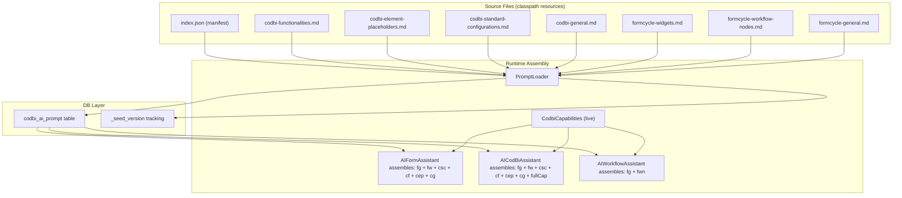

# Plan: Move AI Instructions from Kotlin Files to Database

## Problem

The AI system prompts (instructions) for the three AI assistants — [`AIFormAssistant`](/src/main/kotlin/com/github/xima_formcycle_entwicklerkreis/fc/plugin/codbi/logic/cb/AIFormAssistant.kt), [`AICodBiAssistant`](/src/main/kotlin/com/github/xima_formcycle_entwicklerkreis/fc/plugin/codbi/logic/cb/AICodBiAssistant.kt), and [`AIWorkflowAssistant`](/src/main/kotlin/com/github/xima_formcycle_entwicklerkreis/fc/plugin/codbi/logic/cb/AIWorkflowAssistant.kt) — are currently hardcoded as massive Kotlin string-literal concatenations. These are:

- Thousands of lines long
- Mixed with application logic (string concatenation, line breaks)
- Not modifiable without recompiling the plugin
- Identical content appears in multiple places (e.g., CSS class lists repeated in both pass-1 and pass-2 prompts)

## Solution Overview

Move all AI system prompts into the database by:

1. **Creating a `codbi_ai_prompt` database table** via Liquibase (with rollback support for uninstall)
2. **Extracting prompts into categorized Markdown resource files** organized by the 7 identified categories
3. **Creating a `PromptLoader` service** that seeds the database from classpath resources on plugin startup
4. **Modifying the three AI assistant classes** to load prompts from the database

---

## Prompt Categorization (7 Categories)

Every prompt currently in the code breaks down into these 7 categories:

| # | Category | Contents | Source Examples |
|---|----------|----------|---------------|
| 1 | **CodBi Functionalities** | Rules for each data-cb-func functionality, their parameters, application conditions | OpenPLZ.Autocomplete rules, AI.OCR instructions, Date.Frame/Time.Frame, HTML.Input.REGEX, Form.Navigator, etc. |
| 2 | **CodBi Element Placeholders** | EP syntax, chaining rules, individual EP descriptions | BayVIS EPs, OpenPLZ EPs, DOM.Query, JSON.Path, Data.CSV, Date.Today, F/Find, V/Variable, etc. |
| 3 | **CodBi Standard Configurations** | CSS class descriptions, Matomo tracking activation, standard config activation rules | CodBi_People_*, CodBi_HTML_Panel_*, Holistic.Matomo.Tracking, two-option rule, redundancy rules |
| 4 | **CodBi General** | Cross-cutting CodBi rules that apply to multiple categories | BundID/Bürger-Services exceptions, accordion behavior, panel-fieldset distinction, XAppointment appointmentPlan, AI.chat widget layout, repeatable containers |
| 5 | **Formcycle Widgets** | Form element classNames, properties, datatypes, templates, rendering rules | XTextField, XSelect, XUpload, XButtonList, XContainer, XFieldSet, XSignature, XAppointment, widget plugins (XFormula, XRating, XNavBar, XLanguageSwich, etc.) |
| 6 | **Formcycle Workflow Nodes** | Trigger types, node types, parameters, state management, loop/condition rules | FC_EMAIL, FC_DOI_INIT, FC_SWITCH, FC_MULTIPLE_CONDITION, FC_FOR_EACH_LOOP, FC_BREAK, FC_EXPERIMENT, endpoint states |
| 7 | **Formcycle General** | Cross-cutting Formcycle rules | Server variables ([%\$PROCESS_ID%], etc.), hiddenif/readonlyif rules, placeholders, form record concepts |

---

## Detailed Steps

### Step 1: Liquibase changelog with rollback support

**New file:** `src/main/resources/db/changelog/codbi-ai-prompt-changelog.xml`

```xml
<databaseChangeLog ...>
    <changeSet id="codbi-ai-prompt-1" author="codbi">
        <comment>Create table for AI system prompts</comment>
        <createTable tableName="codbi_ai_prompt">
            <column name="prompt_key" type="VARCHAR(100)">
                <constraints primaryKey="true" nullable="false"/>
            </column>
            <column name="category" type="VARCHAR(50)">
                <constraints nullable="false"/>
            </column>
            <column name="prompt_text" type="CLOB">
                <constraints nullable="false"/>
            </column>
            <column name="prompt_version" type="VARCHAR(50)">
                <constraints nullable="false"/>
            </column>
            <column name="updated_at" type="TIMESTAMP" defaultValueComputed="CURRENT_TIMESTAMP">
                <constraints nullable="false"/>
            </column>
        </createTable>
        <rollback>
            <dropTable tableName="codbi_ai_prompt"/>
        </rollback>
    </changeSet>
</databaseChangeLog>
```

The `rollback` tag ensures Liquibase can drop the table if rollback is executed during uninstall.

Also provide a **manual cleanup changeset** (commented out or documented) for environments where rollback isn't triggered automatically:

```xml
<!-- Manual cleanup: uncomment and run if the plugin is uninstalled
     and Liquibase rollback was not executed automatically -->
<!-- <changeSet id="codbi-ai-prompt-cleanup" author="codbi">
    <comment>Drop AI prompt table on plugin uninstall</comment>
    <dropTable tableName="codbi_ai_prompt"/>
</changeSet> -->
```

**Registration:** Add this changelog to [`CodbiEntities.getLiquibaseScripts()`](/src/main/kotlin/com/github/xima_formcycle_entwicklerkreis/fc/plugin/codbi/logic/CodbiEntities.kt:38).

### Step 2: Prompt resource files (by category)

**Directory:** `src/main/resources/com/github/xima_formcycle_entwicklerkreis/fc/plugin/codbi/prompts/`

```
prompts/
├── index.json                          # Manifest: lists all .md files and their DB keys
├── codbi-functionalities.md            # Category 1: All CodBi functionality instructions
├── codbi-element-placeholders.md       # Category 2: All EP instructions
├── codbi-standard-configurations.md    # Category 3: CSS classes, standards activation
├── codbi-general.md                    # Category 4: Cross-cutting CodBi rules
├── formcycle-widgets.md                # Category 5: Form element types, templates
├── formcycle-workflow-nodes.md         # Category 6: Workflow node instructions
└── formcycle-general.md                # Category 7: Cross-cutting formcycle rules
```

**Format within each `.md` file** — granularized by specific item:

```markdown
# CodBi Functionalities

## AI.LLAMA.CHAT
Instructions for the AI chat widget...
- Parameter rules...
- CSS class assignments...

## AI.OCR
Instructions for OCR extraction...
- Mode=print rules...
- Mode=verify rules...

## OpenPLZ.Autocomplete
Instructions for address autocomplete...
- Required parameters: Country, TargetData, Dependent...
- BundID exception rules...

## Date.Frame
...
```

This approach means:
- Each `.md` file is a **single source of truth** for that category
- Multiple AI assistant prompts can reuse the same section
- A section can be updated in one place and affect all assistants

**Dynamic placeholders:** Use `{{CODBI_ELEMENTS_SECTION}}` and `{{CODBI_FULL_SECTION}}` where the runtime-generated `CodbiCapabilities` content should be injected.

### Step 3: index.json manifest

**New file:** `prompts/index.json`

Maps each prompt file to one or more DB keys and controls the seed/update process:

```json
{
  "version": "1",
  "entries": [
    {"file": "codbi-functionalities.md", "key": "codbi.functionalities"},
    {"file": "codbi-element-placeholders.md", "key": "codbi.element_placeholders"},
    {"file": "codbi-standard-configurations.md", "key": "codbi.standard_configurations"},
    {"file": "codbi-general.md", "key": "codbi.general"},
    {"file": "formcycle-widgets.md", "key": "formcycle.widgets"},
    {"file": "formcycle-workflow-nodes.md", "key": "formcycle.workflow_nodes"},
    {"file": "formcycle-general.md", "key": "formcycle.general"}
  ]
}
```

### Step 4: Create PromptLoader service

**New file:** `src/main/kotlin/com/github/xima_formcycle_entwicklerkreis/fc/plugin/codbi/logic/cb/PromptLoader.kt`

```kotlin
class PromptLoader {
    companion object {
        const val SEED_VERSION_KEY = "_seed_version"
        private const val INDEX_RESOURCE = "com/github/xima_formcycle_entwicklerkreis/fc/plugin/codbi/prompts/index.json"
        private const val PROMPT_DIR = "com/github/xima_formcycle_entwicklerkreis/fc/plugin/codbi/prompts/"
        
        @Volatile private var seedVersion: String? = null
        @Volatile private var promptCache: Map<String, CachedPrompt> = emptyMap()
        
        /**
         * Seeds/updates all prompts from classpath resources into the database.
         * Called on plugin startup when the DB is ready.
         */
        fun seedIfNeeded(emf: EntityManagerFactory, pluginVersion: String) { ... }
        
        /**
         * Loads a prompt by key from the database. Returns null if not found.
         */
        fun loadPrompt(em: EntityManager, key: String): String? { ... }
        
        /**
         * Loads all prompts that match a given category prefix.
         * Used by AI assistants to compose prompts from multiple categories.
         * Example: loadCategory(em, "formcycle") returns all formcycle.* entries.
         */
        fun loadCategory(em: EntityManager, categoryPrefix: String): Map<String, String> { ... }
        
        /**
         * Replaces dynamic placeholders like {{CODBI_FULL_SECTION}}
         * with current runtime-generated content from CodbiCapabilities.
         */
        fun resolvePlaceholders(text: String): String { ... }
    }
}
```

**Seed flow:**
1. [`CodbiEntities.onDatabaseReady()`](/src/main/kotlin/com/github/xima_formcycle_entwicklerkreis/fc/plugin/codbi/logic/CodbiEntities.kt:44) calls `PromptLoader.seedIfNeeded(emf, pluginVersion)`
2. Reads `_seed_version` row from DB
3. If stored version ≠ current plugin version OR no rows exist → read `index.json` + all `.md` files from classpath, upsert each into `codbi_ai_prompt`
4. Update `_seed_version` to current version

### Step 5: Modify AI assistant classes

Each assistant will compose its prompt by loading relevant categories from the DB and concatenating them with `resolvePlaceholders()`.

#### AIFormAssistant.kt — Main system prompt (line 82)

Currently a single monolithic string. Replace with:

```kotlin
private fun buildSystemPrompt(): String {
    val em = CodbiEntities.entityManagerFactory?.createEntityManager()
    if (em == null) return FALLBACK_FORM_SYSTEM_PROMPT
    try {
        val categories = PromptLoader.loadCategory(em, "formcycle", "codbi")
        return PromptLoader.resolvePlaceholders(
            categories["formcycle.general"] + "\n" +
            categories["formcycle.widgets"] + "\n" +
            categories["codbi.standard_configurations"] + "\n" +
            categories["codbi.functionalities"] + "\n" +
            categories["codbi.element_placeholders"] + "\n" +
            categories["codbi.general"]
        )
    } catch (e: Exception) {
        logger.warn("Failed to load prompts, using fallback", e)
        return FALLBACK_FORM_SYSTEM_PROMPT
    } finally {
        em?.close()
    }
}
```

#### AIFormAssistant.kt — Rethink/Apply prompts (lines 405, 551)

These focus on CodBi functionalities only:

```kotlin
// Blind rethink: uses codbi.functionalities + codbi.standard_configurations + codbi.general
// Apply pass: same categories but with different introductory text
```

#### AICodBiAssistant.kt — buildFormSystemPrompt() (line 917)

Same categories as AIFormAssistant but uses `{{CODBI_FULL_SECTION}}` instead of `{{CODBI_ELEMENTS_SECTION}}`:

```kotlin
categories["formcycle.general"] + categories["formcycle.widgets"] + 
categories["codbi.standard_configurations"] + categories["codbi.functionalities"] +
categories["codbi.element_placeholders"] + categories["codbi.general"] +
"{{CODBI_FULL_SECTION}}"
```

#### AICodBiAssistant.kt — classifyIntent() (line 440)

A small, standalone prompt — keep as a short inline string or a separate DB entry `"codbi.classify_intent"`.

#### AIWorkflowAssistant.kt — buildSystemPrompt() (line 247)

Uses workflow-specific categories:

```kotlin
categories["formcycle.general"] + "\n" +
categories["formcycle.workflow_nodes"]
```

### Step 6: Fallback mechanism

Each assistant keeps a **short, minimal fallback** inline in the `.kt` file — not the full thousands-line prompt, just essential core instructions. For example:

```kotlin
private const val FALLBACK_FORM_SYSTEM_PROMPT = 
    "You are a FORMCYCLE form structure assistant. ..."
```

This ensures the plugin works during development or if the DB is temporarily unavailable.

### Step 7: Uninstall cleanup

Since the Liquibase changelog includes a `<rollback>` tag, if Formcycle executes Liquibase rollback on plugin uninstall, the table will be dropped automatically.

To be safe, also add a **documented note** in the plugin's uninstall procedure and provide a standalone SQL script:

**New file:** `scripts/drop-ai-prompt-table.sql`
```sql
-- Run this manually if the plugin is uninstalled and Liquibase rollback
-- did not execute automatically.
DROP TABLE IF EXISTS codbi_ai_prompt;
```

---

## Files to Create

| # | File | Purpose |
|---|------|---------|
| 1 | `src/main/resources/db/changelog/codbi-ai-prompt-changelog.xml` | Liquibase: create `codbi_ai_prompt` table with rollback |
| 2 | `src/main/resources/.../prompts/index.json` | Manifest mapping .md files to DB keys |
| 3 | `src/main/resources/.../prompts/codbi-functionalities.md` | Category 1: CodBi Functionalities |
| 4 | `src/main/resources/.../prompts/codbi-element-placeholders.md` | Category 2: CodBi Element Placeholders |
| 5 | `src/main/resources/.../prompts/codbi-standard-configurations.md` | Category 3: CodBi Standard Configurations |
| 6 | `src/main/resources/.../prompts/codbi-general.md` | Category 4: CodBi General rules |
| 7 | `src/main/resources/.../prompts/formcycle-widgets.md` | Category 5: Formcycle Widgets |
| 8 | `src/main/resources/.../prompts/formcycle-workflow-nodes.md` | Category 6: Formcycle Workflow Nodes |
| 9 | `src/main/resources/.../prompts/formcycle-general.md` | Category 7: Formcycle General rules |
| 10 | `src/main/kotlin/.../cb/PromptLoader.kt` | Service to seed/load prompts from DB |
| 11 | `scripts/drop-ai-prompt-table.sql` | Manual cleanup SQL for uninstall |

## Files to Modify

| # | File | Changes |
|---|------|---------|
| 1 | `CodbiEntities.kt` | Add changelog to `getLiquibaseScripts()`; call `PromptLoader.seedIfNeeded()` in `onDatabaseReady()` |
| 2 | `AIFormAssistant.kt` | Replace hardcoded prompts with DB category loading |
| 3 | `AICodBiAssistant.kt` | Replace hardcoded prompts with DB category loading |
| 4 | `AIWorkflowAssistant.kt` | Replace hardcoded prompts with DB category loading |

---

## Architecture



---

## Key Considerations

1. **Uninstall cleanup:** Table has `<rollback>` tag in Liquibase. Manual SQL script provided as fallback.
2. **Version tracking:** `_seed_version` row ensures prompts are reseeded on each plugin version change.
3. **Transaction safety:** Seeding should be transactional. If it fails, the plugin still initializes with fallback prompts.
4. **Caching:** `PromptLoader` can cache prompts in-memory with a short TTL to avoid DB queries on every AI request.
5. **Development mode:** Modify `.md` files and restart the plugin to test changes — no recompilation needed.
6. **Single source of truth:** Each category file is the single source for that domain. Changes propagate to all AI assistants automatically.
