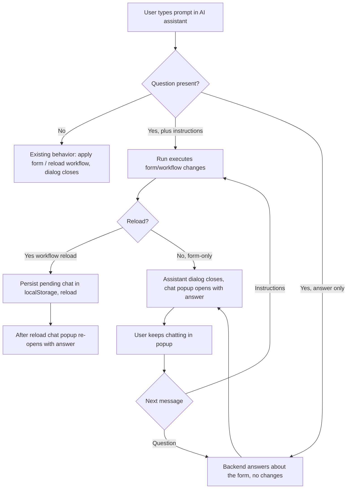

# Form Chat — Ask Questions about the Current Form + Continue Chatting

Goal: let the user ask the AI **questions about the current form** in the same prompt box that is
normally used for instructions, and get the answer in an automatically-opened **chat popup**. The
popup supports a real conversation: further questions are answered, and further instructions
modify the form/workflow exactly like the regular prompt.

## 1. User flows

## 2. Backend — `AICodBiAssistant.kt` (`handleRun`)

The existing `handleRun` already does phase-1 intent classification and phase-2 execution
(form `formJson` / workflow `workflowMessage`, clarification rounds, change log, tokens/cost).
We extend it without changing the existing response shape.

### 2.1 New request params
- `chatHistory` — JSON array of prior `{ "user": "...", "assistant": "..." }` turns (chat popup).
- `chatMode` — `true` when the request comes from the chat popup (popup turns).

### 2.2 New helpers (near the existing `buildFormStructureContext`)
- `parseChatHistory(params): List<ChatTurn>` — parses `chatHistory`.
- `produceChatAnswer(prompt, modelId, instance, formStructureContext, chatTurns, clarificationContext):
  ChatAnswer?` — builds a Q&A system prompt with the **CURRENT FORM STRUCTURE**
  (reuse `buildFormStructureContext`), the chat history and clarification context; asks the AI to
  return JSON `{"hasQuestion": bool, "hasInstructions": bool, "answer": "..."}`. Parses and returns it.
  This runs on **every** run — the AI decides authoritatively whether the prompt contains a question,
  instructions, or both. There is NO heuristic pre-filter (a question can be phrased in too many ways).
- Data classes: `ChatTurn(user, assistant)` and `ChatAnswer(hasQuestion, hasInstructions, answer)`.

### 2.3 `handleRun` wiring
1. Near the top (after `formStructureContext` is computed at ~line 470):
   `val chatMode = params...chatMode?.toBoolean() ?: false`
   and `val chatTurns = parseChatHistory(params)`.
2. **Answer-only shortcut** (before the clarification loop, after `clarificationContext` is built):
   call `produceChatAnswer(...)` on every run (the AI decides `hasQuestion` / `hasInstructions`).
   - If `hasQuestion && !hasInstructions` → return immediately:
     `{"intent": <intent>,"chatAnswer":"...","hasQuestion":true,"tokens":...,"tokensIn":...,"tokensOut":...,"cost":...,"currency":...}`
     (no form/workflow modification, no clarification).
   - Else keep the answer aside in a local `pendingChatAnswer` to attach to the success response.
3. **chatMode re-classification**: if `chatMode` and the turn has instructions, re-run
   `classifyIntent(prompt, ...)` to get the correct intent for execution (a chat turn may be a form
   change, a workflow change, or both), then continue with the normal phase-2 path.
4. **Success response** (before `result.append("}")` at ~line 736): if `pendingChatAnswer?.hasQuestion`,
   append `"hasQuestion":true,"chatAnswer":${gson.toJson(pendingChatAnswer.answer)}`.
   (This attaches the answer for mixed "instructions + question" runs and for initial prompts.)
5. Clarification returns are left unchanged — the answer arrives on the final success response after
   the user answers the clarification.

No new servlet action is required: the chat popup reuses `X-Action: Run` with `chatMode=true`
and `chatHistory`.

## 3. Frontend — `ai-assistant.ts` / `.html` / `.scss`

### 3.1 New state
- `chatVisible = false` — chat popup visibility.
- `chatMessages: Array<{ role: "user" | "assistant"; text: string }>` — conversation.
- `chatInput = ""`, `chatLoading = false`.
- `chatPosition` + `enableDialogDrag` for the chat popup (mirror the clarification popup).
- `pendingChatKey = "codbi-pending-chat"` (localStorage) for reload persistence.

### 3.2 runPhase2 response handling (the three existing branches)
Read `const hasChat = p2["hasQuestion"] === true && typeof p2["chatAnswer"] === "string";`
- **Answer-only branch (NEW)**: before the existing `else { setError("Unexpected response format.") }`,
  add `else if (hasChat) { this.openChat(String(p2["chatAnswer"])); }` so a question-only prompt
  opens the chat popup instead of erroring.
- **Form-only branch** (`doPatch`): after `this.visible = false` + mask removal (+ `openLog` for
  sensitive elements), if `hasChat` → `this.openChat(String(p2["chatAnswer"]))`.
- **Reload branches** (`doReload` for both, and the workflow-only reload): right before
  `window.location.reload()`, write `localStorage.setItem(pendingChatKey, JSON.stringify({ messages: this.chatMessages }))`
  after appending the assistant answer. (Follows the existing `codbi-log-sensitive-elements` pattern.)

### 3.3 Chat popup methods
- `openChat(answer?: string)` — seeds `chatMessages` with the original prompt + answer on first open,
  sets `chatVisible = true`, registers drag, applies remembered position, `markForCheck`.
- `closeChat()`.
- `sendChatMessage()` — no-op when `chatLoading` or input empty; append `{role:"user", text}`; clear
  input; call `runChatTurn(text)`.
- `runChatTurn(message, imageParams=[])` — reuse `runPhase2`'s data assembly with
  `intent="both"`, `chatMode=true`, `chatHistory=JSON.stringify(prior chatMessages)`, `phase="2"`.
  On success, reuse the SAME response handling as `runPhase2`:
  - `chatAnswer` → append `{role:"assistant", text}`.
  - `clarification` → open clarification popup; after answering, re-send the turn (mirror
    `submitClarification`, but re-invoking `runChatTurn`).
  - `formJson`/`workflowMessage` → apply / reload (shared helpers below); on reload persist the chat.

### 3.4 Refactor to avoid duplication
Extract the form-apply + workflow-reload logic out of `runPhase2`'s inline success handler into
reusable methods (e.g. `applyFormJson(p2)`, `handleReload(p2, sensitive, onBeforeReload)`) so both
the main run and chat turns share one implementation. The `runPhase2` success callback then calls
these helpers. This is the largest change and must be done carefully to preserve the existing
(codbi-prop-enable / standards / sensitive-elements) behavior.

### 3.5 Reload re-open
In `ngOnInit`: read `codbi-pending-chat`; if present, restore `chatMessages`, `openChat()` (no new
answer), then `localStorage.removeItem(pendingChatKey)`.

### 3.6 Template (`ai-assistant.html`)
A new `p-dialog` `cb-ai-chat-dialog` (draggable, non-modal or modal like the clarification popup):
- Header: CodBi logo, title "AI Form Chat", copy/close buttons.
- Scrollable message list (user bubbles right, assistant bubbles left).
- Input row: textarea (Ctrl+Enter sends), optional attach (reuse clarification file handling), Send
  button; disabled while `chatLoading`.

### 3.7 Styles (`ai-assistant.scss`)
Styles for `.cb-ai-chat-dialog`, the message list, bubbles, input row, and `max-width/max-height`
viewport caps (consistent with the clarification dialog).

## 4. Edge cases
- **Question-only prompt** (no instructions): backend answer-only shortcut returns `chatAnswer`;
  frontend opens the chat popup (no form change, no error).
- **Instructions + question**: backend executes and attaches `chatAnswer`; form-only closes the
  assistant dialog then opens chat; workflow reload persists chat and re-opens after reload.
- **Clarification + question**: clarification popup appears first; after it is answered the final
  success response carries `chatAnswer` and the chat popup opens.
- **Sensitive elements + question**: change-log popup opens first (existing), chat popup opens after.
- **Empty/ambiguous answer**: fallback answer text; popup still opens so the user can rephrase.
- **Failed run**: existing error toast; chat popup does not open.

## 5. Verification
1. "Welche Felder sind auf Seite 1?" → answer-only; chat popup opens with the answer; no form change.
2. "Füge ein Feld 'Test' hinzu und erkläre danach kurz, was es tut." → form changes applied,
   assistant dialog closes, chat popup opens with the answer.
3. "Erstelle beim Absenden einen Workflow und beantworte dann: Welche Mails werden versendet?" →
   workflow reload persists the chat; after reload the chat popup re-opens with the answer.
4. Chat in popup: question → answer; instruction ("Füge ein Datumsfeld hinzu") → applied, popup stays.
5. Re-run the existing single-element + whole-form/workflow test prompts to confirm no regression.
