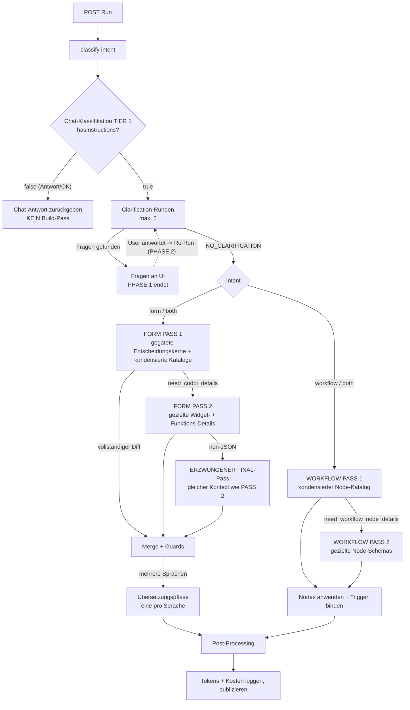
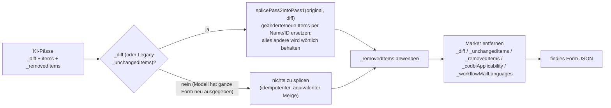

# Form Assistant — Kommunikationsablauf mit der KI (Formulargenerierung)

Mermaid-Sequenzdiagramm des vollständigen Kommunikationsablaufs zwischen Designer-UI, dem
`AICodBiAssistant`-Servlet und dem KI-Modell bei einer Formulargenerierung über den Form Assistant.

Quelle: [`AICodBiAssistant.kt`](../src/main/kotlin/com/github/xima_formcycle_entwicklerkreis/fc/plugin/codbi/logic/cb/AICodBiAssistant.kt)
und [`formassistant-ai-interaction-sequence.md`](./formassistant-ai-interaction-sequence.md).

## Sequenzdiagramm

```mermaid
sequenceDiagram
    autonumber
    actor UI as User (Designer-UI / Form Assistant Dialog)
    participant S as AICodBiAssistant (Servlet)
    participant M as KI-Modell (LLM)
    participant DB as Formcycle DB / Datasources
    participant W as Web (Brave-Suche / URL-Fetch)

    Note over UI,S: PHASE 1 beginnt
    UI->>S: POST Run (Prompt, persist, workflowVersionId, Histories)
    S->>S: Params parsen, Bilder, Chat- & Clarification-Historie laden
    S->>M: classify intent (form | workflow | both)
    M-->>S: Intent
    S->>DB: Baue FORM STRUCTURE, Text-Span-Digest, Workflow-Struktur, Datasources, Mail-Nodes

    Note over S,W: Innerhalb JEDES performFormAssist-Aufrufs kann das Modell<br/>CALL:search / CALL:fetch senden (max. 2 Web-Runden, nur mit Brave-API-Key)
    S->>M: Chat-Klassifikation TIER 1 (kondensierte Struktur, ohne volles Form-JSON)
    opt Modell fragt nach Analytics
        M-->>S: need_matomo_stats
        S->>DB: Matomo-Statistiken laden
        S->>M: Klassifikation MIT Statistiken erneut fragen
    end
    M-->>S: Envelope: hasQuestion, hasInstructions, topics, sections

    alt hasInstructions = FALSE UND keine Clarification-Antworten
        S->>DB: Chat-Eintrag speichern
        S-->>UI: Nur Chat-Antwort (keine Formänderung) — Lauf endet
    else Ein Build ist nötig
        opt hasQuestion = TRUE
            S->>M: Chat-Antwort TIER 2 (mit vollem Form-JSON)
            M-->>S: Antworttext
        end

        loop Clarification-Runden (max. 5)
            S->>M: Clarification-Check (szenario-gegatetes Prompt)
            alt Braucht die Formliste
                M-->>S: need_form_list
                S->>DB: Formliste laden
                S->>M: Clarification MIT Formliste erneut fragen
            else Hat Fragen
                M-->>S: need_clarification (Fragen + Optionen)
                S-->>UI: Clarification-Popup anzeigen — PHASE 1 ENDET
                Note over UI,S: User antwortet; UI startet denselben Endpunkt erneut (PHASE 2) mit clarificationHistory
            else Keine Fragen
                M-->>S: NO_CLARIFICATION
            end
        end

        alt Intent enthält "form"
            S->>M: FORM PASS 1 — sektions-gegatete Entscheidungskerne + kondensierte Kataloge (Diff-Protokoll)
            alt Pass 1 verlangt Details
                M-->>S: need_codbi_details (Elemente + Widgets)
                S->>M: FORM PASS 2 — nur die angefragten Widget-/Funktions-Details
                opt Pass 2 lieferte Non-JSON oder Prosa
                    S->>M: ERZWUNGENER FINAL-Pass (gleicher Kontext wie Pass 2)
                end
            end
            opt Ganzformular-Übersetzung in mehrere Sprachen
                loop ein Pass pro Sprache
                    S->>M: Übersetzungspass (EINE Sprache pro Pass)
                end
            end
            S->>S: Diff mergen + Guards (duplicate/empty XSpans, SVG-Namen, Item-Reihenfolge)
        end

        alt Intent enthält "workflow"
            S->>M: WORKFLOW PASS 1 — kondensierter Node-/Trigger-Katalog
            alt Node-Schemas nötig
                M-->>S: need_workflow_node_details
                S->>M: WORKFLOW PASS 2 — nur die angefragten Node-/Trigger-Schemas
            end
            S->>DB: Nodes anlegen/aktualisieren, Submit-Trigger binden, Workflow-Version invalidieren
        end

        opt "_workflowMailLanguages"-Marker vorhanden (Ganzformular-Übersetzung)
            S->>M: Consumer-Mail-Multilingualisierungs-Pass
            S->>M: Abschlussseiten-Multilingualisierungs-Pass
        end

        S->>DB: Inference protokollieren (Tokens, Kosten, Änderungen), Form publizieren
        S-->>UI: Form-JSON + Tokens + Kosten (+ Chat-Antwort falls vorhanden)
    end
```

## Entscheidungs-Pipeline



## Diff-Materialisierung (Server-seitig)


