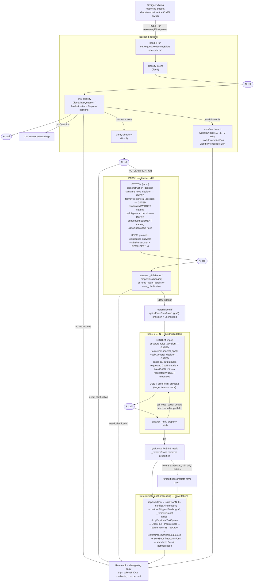

# Form Assistant — AI interaction & token-saving map

Backend ↔ AI interaction of one assistant run (form path), with the token-saving mechanism that is
active on each hop. `IN` = input tokens (prompt), `OUT` = output tokens (answer, incl. reasoning).

## Legend — which mechanism saves what, where

| # | Mechanism | Path | Side | State |
|---:|---|---|:--:|---|
| 1 | `<!--SECTION:-->` gating of the decision cores (`PromptSectionGate`) | pass-1 + pass-2 system | IN | implemented |
| 2 | `.decision` cores instead of the full build files | pass-1 + pass-2 system | IN | implemented |
| 3 | CONDENSED catalogs (heading + first sentence per element/widget) | pass-1 system | IN | implemented |
| 4 | NAME-ONLY CodBi index (`buildNameIndexSection`, ~2 k instead of ~62 k) | pass-2 system (details/blind) | IN | implemented |
| 5 | Targeted details only for the requested ids (`buildFullSectionFor`) | pass-2 system | IN | implemented |
| 6 | Targeted widget templates only for the requested widget ids | pass-2 system | IN | implemented (FULL widget fallback when no ids are requested — the remaining big one) |
| 7 | `slimPersistJson` (stripped code/presentation fields) | pass-1 user content | IN | implemented |
| 8 | `sliceFormForPass2` (target items + leaf stubs) | pass-2 user content | IN | implemented |
| 9 | `_diff` item-level diff; omission = unchanged (server keeps the rest verbatim) | pass-1/pass-2 answer | OUT (and the next pass's IN) | implemented |
| 10 | Property-level patch (`graft()` merge + `_removeProps`) — answer only the changed properties | pass-1/pass-2 answer | OUT | **new** |
| 11 | NO DIRECT WIDGET CREATION — ask for the template instead of building it twice | pass-1 answer | OUT | implemented |
| 12 | Answer-only / ack turns skip pass-1 entirely | classification → early exit | IN+OUT | implemented |
| 13 | Rerun budget `AI_FormAssistant_MaxFormReruns[_<specialist>]` caps the pass-2 loop | pass-2 loop | IN+OUT | implemented |
| 14 | Cache-friendly assembly (`AI_Assistant_PromptCaching=on/auto`) — static prefix first, gates off | pass-1 + pass-2 system | IN | opt-in, only pays off with a real cached-input discount (Cerebras: none) |
| 15 | Reasoning budget — UI dropdown > `AI_Assistant_ReasoningEffort_<specialist>` > `AI_Assistant_ReasoningEffort` > provider default | every external call | OUT | **new** |
| 16 | `_codbiApplicability.codbiVerdict = "none"` on a translation skips a second CodBi evaluation pass | translation runs | IN+OUT | implemented |
| 17 | Clarification round: the ~5.5 k instruction block is re-sent to pass-1 afterwards | clarify-check → pass-1 | IN | **open lever** (skip when the classification is unambiguous) |
| 18 | Re-transmission of unchanged properties of a touched element | pass-1/pass-2 answer | OUT | measured by the `re-emission stats` log line; item 10 is the fix |

## How to read the numbers

- The change-log `trips` array holds one entry per AI call (`tokensIn`, `tokensOut`, `cachedIn`, `cost`),
  so a run's cost can be attributed to the exact pass — `classify-intent`, `chat-classify`,
  `clarify-check#N`, `form-pass-1`, `form-pass-N`, `form-forced-final`, `workflow-*`, `translate[lang]/…`.
- The server log prints the composition of each big prompt (`Pass-1 system prompt: …` / `Pass-2 system
  prompt composition: …`) with the section-kept set, the static-prefix size and the cache-friendly flag,
  plus `form-pass-N re-emission stats`, so every mechanism above can be verified from the log alone.
- Reasoning tokens are billed inside `tokensOut` but are absent from the answer text: compare `tokensOut`
  with `completionChars` of the same trip (JSON answers run ~2.5-4 chars/token).
