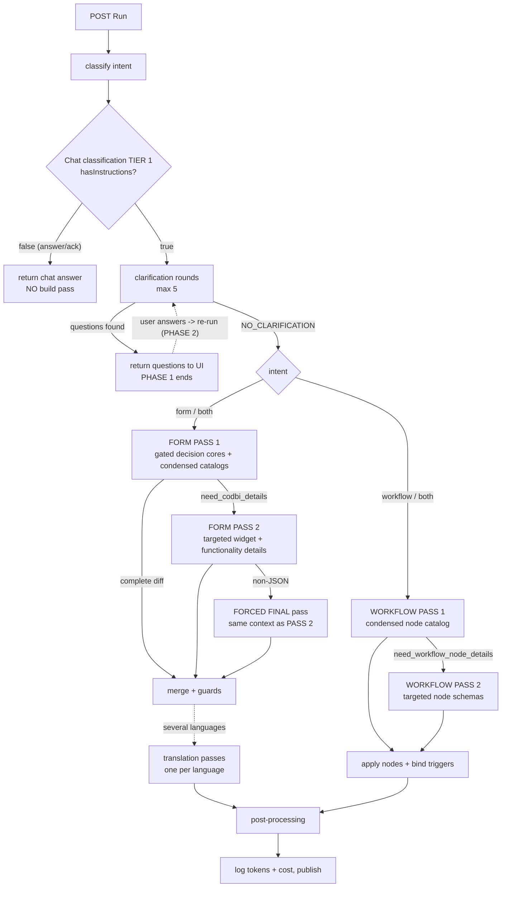
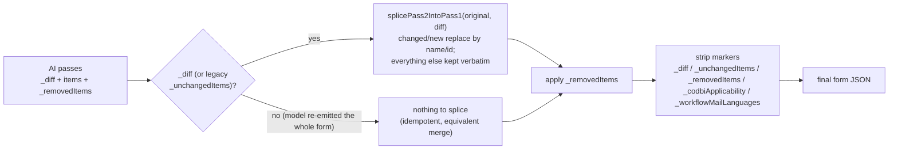

# Form Assistant — AI interaction map (during one inference)

How the AI calls of a single form-assistant run are interconnected, what triggers each one, and when
the run returns to the UI. Derived from
[`AICodBiAssistant`](../src/main/kotlin/com/github/xima_formcycle_entwicklerkreis/fc/plugin/codbi/logic/cb/AICodBiAssistant.kt),
[`runFormModification`](../src/main/kotlin/com/github/xima_formcycle_entwicklerkreis/fc/plugin/codbi/logic/cb/AICodBiAssistant.kt:2058),
[`runWorkflowCreation`](../src/main/kotlin/com/github/xima_formcycle_entwicklerkreis/fc/plugin/codbi/logic/cb/AICodBiAssistant.kt:9147), and
[`Standard.performFormAssist`](../src/main/kotlin/com/github/xima_formcycle_entwicklerkreis/fc/plugin/codbi/logic/cb/ai/llama/Standard.kt:1036).

The assistant is **two-phase**: phase 1 runs with no clarification answers; if it needs input it
returns questions and the UI re-runs the SAME endpoint as phase 2, carrying the answers.

---

## 1. Sequence of AI calls (one run, including phase switch)

```mermaid
sequenceDiagram
    autonumber
    actor U as User (Designer UI)
    participant S as AICodBiAssistant servlet
    participant M as AI model
    participant DB as Formcycle DB / datasources
    participant W as Web (Brave search / URL fetch)

    U->>S: POST Run (prompt, persist, workflowVersionId, histories)
    S->>S: parse params, attached images, chat + clarification history
    S->>M: classify intent (form | workflow | both)
    M-->>S: intent
    S->>DB: build FORM STRUCTURE, text-span digest, workflow structure, datasources, mail nodes

    Note over S,W: Inside EVERY performFormAssist call the model may first emit<br/>CALL:search / CALL:fetch (max 2 web rounds, only with a Brave API key)
    S->>M: Chat classification TIER 1 (condensed structure, no full form JSON)
    opt model asks for analytics
        M-->>S: need_matomo_stats
        S->>DB: fetch Matomo statistics
        S->>M: re-ask classification WITH statistics
    end
    M-->>S: envelope: hasQuestion, hasInstructions, topics, sections

    alt hasInstructions = false AND no clarification answers
        S->>DB: record chat entry
        S-->>U: chat answer only (no form change) — run ends
    else a build is needed
        opt hasQuestion = true
            S->>M: Chat answer TIER 2 (with the full form JSON)
            M-->>S: answer text
        end

        loop clarification rounds (at most 5)
            S->>M: clarification check (scenario-gated prompt)
            alt needs the form list
                M-->>S: need_form_list
                S->>DB: load form list
                S->>M: re-ask clarification with the list
            else has questions
                M-->>S: need_clarification (questions + options)
                S-->>U: show clarification popup — PHASE 1 ENDS
                Note over U,S: user answers; UI re-runs the same endpoint (PHASE 2) carrying clarificationHistory
            else
                M-->>S: NO_CLARIFICATION
            end
        end

        alt intent includes form
            S->>M: FORM PASS 1 — section-gated decision cores + condensed catalogs (diff protocol)
            alt pass 1 requested details
                M-->>S: need_codbi_details (elements + widgets)
                S->>M: FORM PASS 2 — only the requested widget/functionality details
                opt pass 2 returned non-JSON or prose
                    S->>M: FORCED FINAL pass (same context as pass 2)
                end
            end
            opt whole-form translation into several languages
                loop one pass per language
                    S->>M: translation pass (ONE language per pass)
                end
            end
            S->>S: merge diff + guards (duplicate/empty XSpans, SVG name repair, item order)
        end

        alt intent includes workflow
            S->>M: WORKFLOW PASS 1 — condensed node/trigger catalog
            alt node schemas needed
                M-->>S: need_workflow_node_details
                S->>M: WORKFLOW PASS 2 — only the requested node/trigger schemas
            end
            S->>DB: create/update nodes, bind submit trigger, invalidate workflow version
        end

        opt "_workflowMailLanguages" marker present (whole-form translation)
            S->>M: consumer-mail multilingualization pass
            S->>M: ending-page multilingualization pass
        end

        S->>DB: record inference (tokens, cost, changes), publish form
        S-->>U: form JSON + tokens + cost (+ chat answer if any)
    end
```

---

## 2. Decision pipeline (what runs, in which order)



---

## 3. What happens when — trigger table

| AI call | Fires when | Prompt content | Can it loop? |
|---|---|---|---|
| `classify intent` | always, first | intent prompt + form/workflow context | no |
| Chat classification TIER 1 | always, after intent | chat prompt + condensed **FORM STRUCTURE** (no full form JSON) + histories | up to 2 rounds if it asks for Matomo stats |
| Chat answer TIER 2 | only when `hasQuestion` | TIER 1 + the **complete form JSON** | no |
| Clarification check | only when a build is needed | scenario-gated clarification prompt + datasources / mail nodes / form vars | up to 5 rounds; re-asks after `need_form_list` |
| FORM PASS 1 | intent `form`/`both`, after clarification | section-gated decision cores + condensed catalogs + diff protocol | one `need_codbi_details` round |
| FORM PASS 2 | pass 1 asked for details | decision-core base + **only** the requested details/templates | one forced-final retry on non-JSON |
| Translation pass (×N) | pass 1 signals a whole-form translation with N languages | per-language instruction, sequential | one per language |
| WORKFLOW PASS 1 | intent `workflow`/`both` | workflow task instruction + condensed node/trigger catalog | one `need_workflow_node_details` round |
| WORKFLOW PASS 2 | workflow pass 1 asked for schemas | requested node/trigger sections only | no |
| Mail / ending-page multilingualization | only when `_workflowMailLanguages` is present | condensed candidate list + workflow context | no |
| `CALL:search` / `CALL:fetch` | model emits the marker | injected into the SAME call's conversation | max 2 rounds per call |

### Notes

- **Section gating** ([`PromptSectionGate`](../src/main/kotlin/com/github/xima_formcycle_entwicklerkreis/fc/plugin/codbi/logic/cb/PromptSectionGate.kt)) applies only to the FORM PASS 1 system prompt: it keeps the
  always-on decision core plus the `<!--SECTION:tag-->` blocks the request needs (AI `sections` ∪
  deterministic detectors, fail-open). Pass 2 and the workflow path are untouched.
- **The Matomo statistics** round is handled inside the chat classification tier (at most once per
  tier), and the fetched summary is reused by the build pass so an "analyse and optimise" request
  sees it.
- **Answer-only short-circuit**: a message the classifier reports as `hasInstructions=false` (a
  question or an "ok") never reaches pass 1 — but a re-run carrying clarification answers always
  proceeds to build.
- **Tokens/cost** are accumulated across every call above (classification, clarification, pass 1,
  pass 2, forced final, translation, workflow, multilingualization) and returned to the UI, then
  written to the change log via `AiAssistantLog.recordInference`.

---

## 4. How the AI returns the form — a DIFF, not the whole form

The build passes return a **diff**; the server splices it onto the original form. The
`"return the COMPLETE form"` wording still in the prompts is explicitly overridden — it means the
*resulting* form stays complete, not that every item must be re-emitted (see
[`codbi-form-task-instruction.decision.md`](../src/main/resources/com/github/xima_formcycle_entwicklerkreis/fc/plugin/codbi/prompts/codbi-form-task-instruction.decision.md:35)
and the pass-1 user content [`REMINDER 3`](../src/main/kotlin/com/github/xima_formcycle_entwicklerkreis/fc/plugin/codbi/logic/cb/AICodBiAssistant.kt:2201)).

### The envelope the model returns

| Field | Meaning |
|---|---|
| `"_diff": true` | Declares the response is a **diff** (only changed/new items) — required for the splice. |
| `items` | **Only** the items that are ADDED, MODIFIED, or whose STRUCTURE changed. |
| `_removedItems: ["name", …]` | Names of the elements to remove — the ONLY way an element leaves the form. |
| `_unchangedItems: ["name", …]` | Legacy (pre-`_diff`) declaration — still accepted, no longer requested. |
| `_removeAll: true` | "Remove all fields": keep page/header/footer as empty shells. |
| `_codbiApplicability` | Pass-1 verdict (can skip the second CodBi pass). |
| `_workflowMailLanguages` | Whole-form-translation marker for mail/end-page multilingualization. |

### What must still be sent IN FULL

- A **container / page / fieldset whose structure changed** (a child added, moved or removed) is
  re-authored in full — including its complete `elements` array — and therefore must be present in
  `items` (an item that is not re-emitted is kept verbatim, so a CHANGED container must be emitted).
- The **`rtevalue`** of a modified element is returned complete (a partial-HTML edit changes only the
  targeted part, keeping every other paragraph, `<style>`/`<script>` and markup byte-for-byte).
- A **whole-form translation** legitimately re-emits every element (it adds per-language `i18n`) —
  that is documented as the intended exception.

### Server-side materialization



- [`splicePass2IntoPass1`](../src/main/kotlin/com/github/xima_formcycle_entwicklerkreis/fc/plugin/codbi/logic/cb/AICodBiAssistant.kt:3441) replaces items matched by **id/name** and keeps every pass-1 item the AI did
  not re-emit — so the merge is **information-preserving** and **idempotent**: if the model ignores
  the diff hint and re-emits everything, the result is equivalent; if it omits an item without
  listing it, nothing is lost.
- Pass-1 materializes the diff immediately when the response **declares a diff**
  ([`FormDiffMarker.isDeclared`](../src/main/kotlin/com/github/xima_formcycle_entwicklerkreis/fc/plugin/codbi/logic/cb/FormDiffMarker.kt:1) — the `"_diff": true` flag, or the legacy
  `_unchangedItems` list); **pass 2 and the forced-final retry use the same diff protocol**, so every
  subsequent stage always works on a complete form.
- Because omission means UNCHANGED, **deletions happen ONLY via `_removedItems`**
  ([`applyRemovedItems`](../src/main/kotlin/com/github/xima_formcycle_entwicklerkreis/fc/plugin/codbi/logic/cb/AICodBiAssistant.kt:5434)). An item named in a legacy `_unchangedItems` list is
  protected from being replaced by a partial re-emission.
- The `_diff` flag is added to `IGNORED_AI_MARKERS` and stripped by the splice, so it can never be
  persisted as form data; the full `formcycle.general` is no longer used as a pass-2 fallback
  because it still carries the legacy "return the COMPLETE modified form JSON" wording.
- The markers are consumed by dedicated server passes and stripped before persisting, so they never
  reach the Formcycle designer as stray top-level fields.
