# Form Assistant — AI communication paths & per-path token reduction

Code: [`AICodBiAssistant.kt`](../src/main/kotlin/com/github/xima_formcycle_entwicklerkreis/fc/plugin/codbi/logic/cb/AICodBiAssistant.kt), [`PromptSectionGate.kt`](../src/main/kotlin/com/github/xima_formcycle_entwicklerkreis/fc/plugin/codbi/logic/cb/PromptSectionGate.kt).

Measured reference run: `form-pass-2` 48 %, `form-pass-1` 34 %, `clarify-check#1` 15 %, `classify-intent` 3.5 % (input ≈ 92 % of the bill).

> Layout: left → right. Labels use explicit ` ` line breaks and `•` bullets — Mermaid only wraps at explicit breaks, so every line stays short and nothing clips.

## Paths from prompt to form generation

```mermaid
flowchart LR
    RUN(["POST /Run<br/>prompt + persist + histories"]) --> CLS

    CLS["Path 0 · Classify intent<br/>classify intent<br/>(form / workflow / both)<br/><br/>Reduction:<br/>• no second inference<br/>• auxiliary model per role<br/>• reasoning budget:<br/>&nbsp;&nbsp;UI > specialist > global<br/>• ≈ 2.1 k in"]

    CLS --> T1

    T1["Path 1 · Chat tier-1<br/>condensed structure,<br/>full form JSON WITHHELD<br/><br/>Reduction:<br/>• withhold ~60 KB form<br/>• answer/ack ends the run<br/>&nbsp;&nbsp;before any build pass<br/>• tier-1 ≈ 11 k in<br/>&nbsp;&nbsp;vs 116 k chars form"]

    T1 -->|"hasInstructions = false"| ANS(["Answer / ack only<br/>NO build pass"])
    T1 -->|"hasInstructions = true"| T2

    T2["Path 1 · Chat tier-2<br/>full form JSON included<br/><br/>Reduction:<br/>• sent only when<br/>&nbsp;&nbsp;hasQuestion = true"]

    T2 --> CLR
    T1 --> CLR

    CLR["Path 2 · Clarify check (optional)<br/>runs only when tier-1<br/>needsClarification<br/>or a reference veto<br/><br/>Reduction:<br/>• whole round skipped<br/>&nbsp;&nbsp;by default<br/>• <!--CLARIFY:--> gating<br/>&nbsp;&nbsp;(fail-open: no tag = kept)<br/>• form list only on<br/>&nbsp;&nbsp;need_form_list<br/>• was 8.7 k in → often 0"]

    CLR -->|"NO_CLARIFICATION"| P1
    CLR -->|"questions"| ASK(["Clarification popup<br/>user answers → re-run"])

    P1["Path 3 · Form PASS 1<br/>gated decision cores +<br/>condensed catalogs<br/><br/>Reduction:<br/>• cores de-duplicated<br/>&nbsp;&nbsp;(single home per rule)<br/>• <!--SECTION:--> gating:<br/>&nbsp;&nbsp;field_creation, removal,<br/>&nbsp;&nbsp;designed_text, svg,<br/>&nbsp;&nbsp;custom_js, translation,<br/>&nbsp;&nbsp;repeatable, panels<br/>• NAME-ONLY CodBi index<br/>• condensed widget catalog<br/>• diff protocol:<br/>&nbsp;&nbsp;changed/new items only<br/>• 27 blocks ≈ 17 k chars<br/>&nbsp;&nbsp;dropped per build run"]

    P1 -->|"no details needed"| MRG
    P1 -->|"need_codbi_details"| P2
    P1 -->|"intent = workflow / both"| W1

    P2["Path 4 · Form PASS 2<br/>only the requested<br/>widget / CodBi details<br/>+ targeted templates<br/><br/>Reduction:<br/>• targeted templates only<br/>• avoids the full widget<br/>&nbsp;&nbsp;reference (~20–25 k)<br/>• sliceFormForPass2<br/>• slimPersistJson:<br/>&nbsp;&nbsp;relevant slice only"]

    P2 --> MRG
    P2 -->|"non-JSON / prose"| FIN

    FIN["Path 4b · Forced final pass<br/>same context as PASS 2<br/><br/>Reduction:<br/>• only on non-JSON<br/>• reuses the pass-2 context,<br/>&nbsp;&nbsp;no re-assembly"]

    FIN --> MRG

    W1["Path 6 · Workflow PASS 1<br/>condensed node / trigger<br/>catalog<br/><br/>Reduction:<br/>• condensed catalog<br/>• schemas deferred to PASS 2"]

    W1 -->|"need_workflow_node_details"| W2

    W2["Path 6 · Workflow PASS 2<br/>only the requested<br/>node / trigger schemas<br/><br/>Reduction:<br/>• schemas on demand"]

    W2 --> APL
    W1 --> APL

    MRG["Path 7 · Merge / splice<br/>splicePass2IntoPass1<br/>(property-level graft)<br/><br/>Reduction:<br/>• _diff / _removeProps<br/>• omit = unchanged<br/>• server restores the value<br/>• lossless, no full<br/>&nbsp;&nbsp;re-emission"]

    MRG -->|"adds / edits a language"| TR
    MRG --> APL

    TR["Path 5 · Translation<br/>whole-form: ONE language<br/>per pass<br/>edit: DELTA view +<br/>bounded batches<br/><br/>Reduction:<br/>• only the delta,<br/>&nbsp;&nbsp;not the whole form<br/>• batching: group small<br/>&nbsp;&nbsp;languages together"]

    TR --> APL

    APL["Path 7 · Apply to Formcycle<br/>nodes / items persisted<br/><br/>Reduction:<br/>• none — the write itself<br/>&nbsp;&nbsp;costs no tokens"]

    APL --> PUB
    LOG["Path 8 · Apply-from-log<br/>replay a stored artifact<br/>deterministically<br/><br/>Reduction:<br/>• zero inference<br/>• 0 tokens"] -->|"re-apply"| PUB

    PUB(["Publish + log tokens & cost"]) --> OUT(["Form JSON to UI"])

    CACHE["Cross-cutting ·<br/>opt-in prompt caching<br/>cache-friendly prefix<br/>(AI_Assistant_PromptCaching)"] -.-> P1
    CACHE -.-> P2
    ESC["Cross-cutting ·<br/>compact + unescaped payloads:<br/>• HTML-escaping off<br/>• compact JSON<br/>• in every AI payload<br/>&nbsp;&nbsp;and change-log row"] -.-> RUN
    AUX["Cross-cutting ·<br/>auxiliary model per role<br/>AI_Assistant_AuxModel<br/>• _classify · _clarify<br/>• _repair · _translate"] -.-> CLS
    AUX -.-> CLR
```

## Quick per-path summary

| Path | Token reduction |
|---|---|
| Classify intent | • tiny prompt (~2.1 k in) · • no second inference · • auxiliary model per role |
| Chat tier-1 | • full form JSON withheld · • answer/ack ends the run |
| Chat tier-2 | • only when `hasQuestion = true` |
| Clarify check | • usually skipped · • `<!--CLARIFY:-->` gating · • form list on demand |
| Form PASS 1 | • de-duplicated cores · • `<!--SECTION:-->` gating · • NAME-ONLY index · • diff output |
| Form PASS 2 | • requested details/templates only · • relevant form slice |
| Forced final pass | • only on non-JSON · • reuses pass-2 context |
| Translation | • one language per pass or a delta · • batched |
| Workflow | • condensed catalog · • schemas on demand |
| Merge / splice | • `_diff` / `_removeProps` (omit = unchanged) |
| Apply-from-log | • 0 tokens |
| Cross-cutting | • compact + unescaped payloads · • opt-in prompt cache · • auxiliary model per role |
