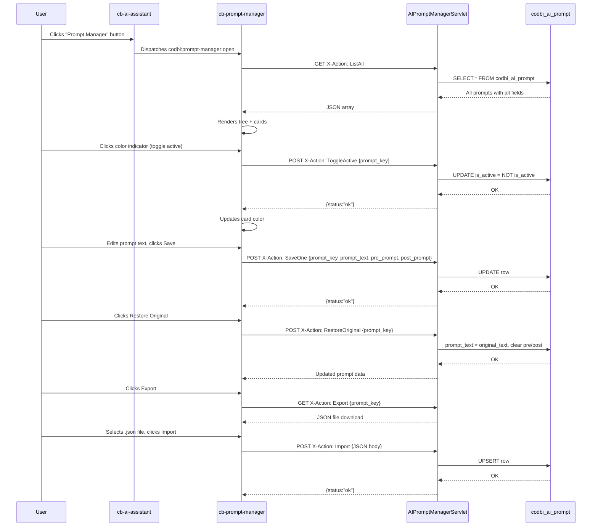

# Prompt Manager — Architecture & Implementation Plan

## Overview

Add an interactive Prompt Manager to the CodBi AI Assistant that lets users view, edit, activate/deactivate, restore, and import/export AI system prompts. Accessible via a dedicated button in the AI assistant dialog.

---

## Architecture

```
┌─────────────────────────────────────────────────────────┐
│                    Browser (Angular)                     │
│  ┌──────────────────────────────────────────────────┐   │
│  │          cb-ai-assistant (existing)              │   │
│  │  ┌──────────┐  ┌─────────────────────────────┐   │   │
│  │  │  Prompt  │  │    Prompt Manager Dialog     │   │   │
│  │  │ Manager  │  │  ┌─────────────────────────┐ │   │   │
│  │  │ Button   │──│  │ Tree View (by category) │ │   │   │
│  │  └──────────┘  │  ├─────────────────────────┤ │   │   │
│  │                │  │ Prompt Cards             │ │   │   │
│  │                │  │  [Color: active/inactive]│ │   │   │
│  │                │  │  [Title / Expand]        │ │   │   │
│  │                │  │  [Edit / Restore / I/E]  │ │   │   │
│  │                │  └─────────────────────────┘ │   │   │
│  │                └─────────────────────────────┘   │   │
│  └──────────────────────────────────────────────────┘   │
└──────────────────────┬──────────────────────────────────┘
                       │ HTTP (X-Action header)
┌──────────────────────▼──────────────────────────────────┐
│                  Kotlin Backend (Formcycle Plugin)        │
│  ┌──────────────────────────────────────────────────┐   │
│  │         AIPromptManagerServletAction (NEW)        │   │
│  │  ┌──────────┐  ┌──────────┐  ┌────────────────┐ │   │
│  │  │ ListAll  │  │ SaveOne  │  │ RestoreOriginal│ │   │
│  │  ├──────────┤  ├──────────┤  ├────────────────┤ │   │
│  │  │ Toggle   │  │ Export   │  │ Import         │ │   │
│  │  └──────────┘  └──────────┘  └────────────────┘ │   │
│  └──────────────────────────────────────────────────┘   │
│  ┌──────────────────────────────────────────────────┐   │
│  │             PromptLoader (extended)               │   │
│  │  - loadActivePrompts() → only active prompts     │   │
│  │  - savePrompt(), restoreOriginal()               │   │
│  └──────────────────────────────────────────────────┘   │
│  ┌──────────────────────────────────────────────────┐   │
│  │       codbi_ai_prompt (Liquibase v2)             │   │
│  │  NEW columns: is_active, pre_prompt,             │   │
│  │  post_prompt, original_text, display_name        │   │
│  └──────────────────────────────────────────────────┘   │
└──────────────────────────────────────────────────────────┘
```

---

## Step 1: Database — Liquibase changeset v2

**File:** [`src/main/resources/db/changelog/codbi-ai-prompt-changelog.xml`](src/main/resources/db/changelog/codbi-ai-prompt-changelog.xml)

Add a new changeset (id: `codbi-ai-prompt-2`) that adds columns to `codbi_ai_prompt`:

| Column | Type | Default | Description |
|--------|------|---------|-------------|
| `is_active` | `BOOLEAN` | `TRUE` | Whether to include this prompt in AI requests |
| `pre_prompt` | `CLOB` | `NULL` | Custom user text prepended before the prompt |
| `post_prompt` | `CLOB` | `NULL` | Custom user text appended after the prompt |
| `original_text` | `CLOB` | `NULL` | Backup of the seeded prompt text for restore |
| `display_name` | `VARCHAR(200)` | `NULL` | Human-readable name for the UI |

Also backfill `original_text` = `prompt_text` for all existing rows.

---

## Step 2: Kotlin Backend — AIPromptManagerServletAction

**New file:** `src/main/kotlin/.../logic/cb/AIPromptManagerServletAction.kt`

Implements `IPluginServletAction` (name: `"CodBi_AIPromptManager"`).

### Actions (via X-Action header):

| X-Action | Method | Description |
|----------|--------|-------------|
| `ListAll` | GET | Returns all prompts as JSON array with all fields |
| `SaveOne` | POST | Updates `prompt_text`, `pre_prompt`, `post_prompt`, `display_name`, `is_active` for one key |
| `RestoreOriginal` | POST | Copies `original_text` → `prompt_text` and clears `pre_prompt`, `post_prompt` for one key |
| `Export` | GET | Returns a single prompt as downloadable JSON file `{key, display_name, prompt_text, pre_prompt, post_prompt}` |
| `Import` | POST | Accepts JSON body and upserts a single prompt |
| `ToggleActive` | POST | Flips `is_active` for one key |

### Response format:
```json
{
  "status": "ok",
  "prompts": [
    {
      "prompt_key": "formcycle.general",
      "display_name": "Formcycle General",
      "category": "formcycle",
      "prompt_text": "...",
      "original_text": "...",
      "pre_prompt": "...",
      "post_prompt": "...",
      "is_active": true
    }
  ]
}
```

---

## Step 3: Modify PromptLoader to respect is_active

**File:** [`src/main/kotlin/.../logic/cb/PromptLoader.kt`](src/main/kotlin/.../logic/cb/PromptLoader.kt)

- Modify `loadCategory()` to only return prompts where `is_active = TRUE`
- Modify `loadPrompt()` to only return prompts where `is_active = TRUE`
- Add `loadActivePrompts()` method used by the AI assistants
- Add `savePrompt()`, `restoreOriginal()` helper methods used by the servlet

**Critical:** The AI assistant prompt-building methods (e.g. [`buildCodbiFormSystemPrompt()`](src/main/kotlin/.../logic/cb/AICodBiAssistant.kt:7198), [`loadWorkflowPrompt()`](src/main/kotlin/.../logic/cb/AIWorkflowAssistant.kt:319), [`buildMainSystemPrompt()`](src/main/kotlin/.../logic/cb/AIFormAssistant.kt:1218)) must:
1. Include `pre_prompt` text before each section's `prompt_text`
2. Include `post_prompt` text after each section's `prompt_text`
3. Skip sections where `is_active = FALSE`

---

## Step 4: Frontend — PromptManager Angular Component

**New directory:** `src/main/web/packages/designer/Angular/Components/codbi-apidoc/projects/manager/src/app/prompt-manager/`

Files:
- `prompt-manager.ts` — Component logic
- `prompt-manager.html` — Template
- `prompt-manager.scss` — Styles

### Component Design

#### Layout:
```
┌──────────────────────────────────────────────┐
│  Prompt Manager                      [Close] │
├────────────┬─────────────────────────────────┤
│            │  ┌───────────────────────────┐  │
│  TREE      │  │ formcycle.general         │  │
│  VIEW      │  │ [ACTIVE] [▼] [Edit][...] │  │
│            │  ├───────────────────────────┤  │
│ 📁 formcycle│  │ formcycle.widgets         │  │
│  📄 general│  │ [ACTIVE] [▼] [Edit][...] │  │
│  📄 widgets│  ├───────────────────────────┤  │
│  📄 workflow│  │ formcycle.workflow_nodes  │  │
│            │  │ [ACTIVE] [▼] [Edit][...] │  │
│ 📁 codbi   │  └───────────────────────────┘  │
│  📄 funct..│                                 │
│  📄 element│                                 │
│  etc.      │                                 │
└────────────┴─────────────────────────────────┘
```

#### Tree View (left panel):
- PrimeNG [`p-tree`](https://primeng.org/tree) component
- Top-level nodes = categories (`formcycle`, `codbi`)
- Child nodes = individual prompt keys
- Clicking a node selects the card in the right panel

#### Prompt Card (right panel):

Each card has:

1. **Color indicator** (left border / left region):
   - **Green** (#39D088) = active
   - **Gray** (#AEC3C6) = inactive
   - Click on the color region toggles active/inactive (no checkbox)

2. **Header** — `display_name` or `prompt_key`

3. **Expandable body** (click to toggle):

   ```
   ┌──🟢────────────────────────────────────┐
   │ formcycle.general               [▼][ⓘ] │
   ├────────────────────────────────────────┤
   │ [Pre-Prompt] (editable textarea, small) │
   │ ┌────────────────────────────────────┐ │
   │ │ User-entered pre-prompt text       │ │
   │ └────────────────────────────────────┘ │
   │                                         │
   │ **Prompt** (main editable textarea)     │
   │ ┌────────────────────────────────────┐ │
   │ │ The actual prompt content...       │ │
   │ └────────────────────────────────────┘ │
   │                                         │
   │ [Post-Prompt] (editable textarea, small)│
   │ ┌────────────────────────────────────┐ │
   │ │ User-entered post-prompt text      │ │
   │ └────────────────────────────────────┘ │
   │                                         │
   │ [Save] [Restore Original] [Export] [Import]│
   └──────────────────────────────────────────┘
   ```

4. **Action buttons** (bottom of expanded card):
   - **Save** — calls `SaveOne` action
   - **Restore Original** — calls `RestoreOriginal` action (restores `original_text` → `prompt_text`, clears pre/post)
   - **Export** — calls `Export` action, downloads JSON file named `{key}.json`
   - **Import** — file picker for `.json`, calls `Import` action

#### Integration with AI Assistant:

- Add a **"Prompt Manager"** button to the [`ai-assistant.html`](src/main/.../ai-assistant/ai-assistant.html) template, positioned near the model selector
- On click, emit a `codbi:prompt-manager:open` custom event
- The `PromptManager` component listens for this event and shows a PrimeNG dialog (`p-dialog`)
- The `PromptManager` component is registered as a custom element `cb-prompt-manager` in [`main.ts`](src/main/.../main.ts)

---

## Step 5: Register custom element

**File:** [`src/main/web/packages/designer/Angular/Components/codbi-apidoc/projects/manager/src/main.ts`](src/main/.../main.ts)

Add:
```typescript
import { PromptManager } from "./app/prompt-manager/prompt-manager";
customElements.define("cb-prompt-manager", createCustomElement(PromptManager, { injector: appRef.injector }));
```

---

## Step 6: Wire the button in the AI assistant dialog

**File:** [`src/main/web/.../ai-assistant/ai-assistant.ts`](src/main/.../ai-assistant/ai-assistant.ts)

- Add a `openPromptManager()` method that:
  1. Ensures the `cb-prompt-manager` element exists in the DOM
  2. Dispatches `codbi:prompt-manager:open` event

**File:** [`src/main/web/.../ai-assistant/ai-assistant.html`](src/main/.../ai-assistant/ai-assistant.html)

- Add a button (gear icon) next to the model selector

---

## Step 7: Modify AI assistant prompt building

**Files:**
- [`AICodBiAssistant.kt`](src/main/kotlin/.../logic/cb/AICodBiAssistant.kt)
- [`AIFormAssistant.kt`](src/main/kotlin/.../logic/cb/AIFormAssistant.kt)
- [`AIWorkflowAssistant.kt`](src/main/kotlin/.../logic/cb/AIWorkflowAssistant.kt)

Each prompt-building method (e.g. `loadCodbiRethinkPrompt()`, `loadWorkflowPrompt()`, `buildMainSystemPrompt()`) must be updated to:
1. Query prompts with `is_active = TRUE` only
2. For each prompt section, concatenate: `pre_prompt` + `prompt_text` + `post_prompt`
3. Skip sections where `is_active = FALSE`

---

## Files to Create

| # | File | Purpose |
|---|------|---------|
| 1 | `src/main/kotlin/.../logic/cb/AIPromptManagerServletAction.kt` | Backend REST API for prompt CRUD |
| 2 | `src/main/web/.../prompt-manager/prompt-manager.ts` | Angular component |
| 3 | `src/main/web/.../prompt-manager/prompt-manager.html` | Template |
| 4 | `src/main/web/.../prompt-manager/prompt-manager.scss` | Styles |

## Files to Modify

| # | File | Change |
|---|------|--------|
| 1 | `src/main/resources/db/changelog/codbi-ai-prompt-changelog.xml` | Add changeset v2 with new columns |
| 2 | `src/main/kotlin/.../logic/cb/PromptLoader.kt` | Add `savePrompt()`, `restoreOriginal()`, active-only filtering, pre/post prompt concatenation |
| 3 | `src/main/kotlin/.../logic/cb/AICodBiAssistant.kt` | Use active-only prompts with pre/post wrapping |
| 4 | `src/main/kotlin/.../logic/cb/AIFormAssistant.kt` | Same as above |
| 5 | `src/main/kotlin/.../logic/cb/AIWorkflowAssistant.kt` | Same as above |
| 6 | `src/main/web/.../ai-assistant/ai-assistant.ts` | Add `openPromptManager()` method |
| 7 | `src/main/web/.../ai-assistant/ai-assistant.html` | Add "Prompt Manager" button |
| 8 | `src/main/web/.../manager/src/main.ts` | Register `cb-prompt-manager` custom element |
| 9 | `src/main/web/.../CodbiFormDesignerResourcePlugin.kt` | Ensure `prompt-manager.js` is loaded (if needed) |

---

## Mermaid Sequence — Prompt Manager Flow


