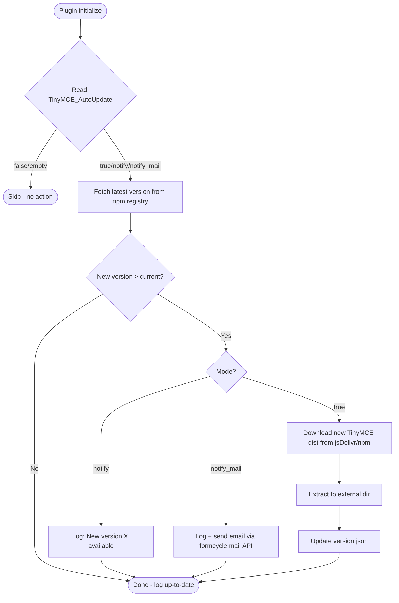

# TinyMCE Auto-Update Feature — Architectural Plan

## 1. Overview

Add plugin configuration properties that control whether TinyMCE should periodically check for new versions online and automatically update the local distribution.

## 2. Configuration Properties

### 2.1 Main Switch

**Property:** `TinyMCE_AutoUpdate`

| Value | Behavior |
|-------|----------|
| `false` or empty | Disabled (default) — no checks |
| `true` | Check on plugin restart, auto-download and update if newer version found |
| `notify` | Check on plugin restart, log a message, but do NOT update |
| `notify_mail=admin@example.com` | Check, log, AND send notification email to the specified address |

### 2.2 Version Check URL

**Property:** `TinyMCE_Update_VersionURL`

The URL to query for the latest available version. Expected to return JSON with a `version` field.

| Default | `https://registry.npmjs.org/tinymce/latest` |
|---------|---------------------------------------------|
| Example response | `{ "version": "6.8.3" }` |
| Purpose | Allows using a local mirror or custom version API |

### 2.3 Download Base URL

**Property:** `TinyMCE_Update_DownloadBaseURL`

The base URL from which TinyMCE distribution files are downloaded. The placeholder `{version}` is replaced with the target version number.

| Default | `https://cdn.jsdelivr.net/npm/tinymce@{version}` |
|---------|--------------------------------------------------|
| Example with version | `https://cdn.jsdelivr.net/npm/tinymce@6.8.3` |
| Files downloaded | `{baseURL}/tinymce.min.js`, `{baseURL}/skins/...`, `{baseURL}/plugins/...`, etc. |
| Purpose | Allows using a local mirror or private CDN |

### 2.4 Where properties are read

All three properties are read in `CodbiFormResourcesPlugin.initialize()` via `initData?.properties?.getProperty("TinyMCE_*")`.

## 3. Architecture

### 3.1 New Kotlin Object: `TinyMCEUpdater`

Create [`src/main/kotlin/.../cb/TinyMCEUpdater.kt`](src/main/kotlin/com/github/xima_formcycle_entwicklerkreis/fc/plugin/codbi/logic/cb/TinyMCEUpdater.kt)

```kotlin
object TinyMCEUpdater : CodBi() {
  // Reads TinyMCE_AutoUpdate property
  // Has checkAndUpdate() method called from initialize()
}
```

### 3.2 External Storage Directory

Since JAR resources cannot be modified at runtime, updated TinyMCE files are stored in an **external directory**:

```
{formcycle.data.dir}/codbi/tinymce/
```

This directory is created on first update. The `Resource.kt` servlet is modified to check this directory **first** before falling back to the classpath.

### 3.3 Version Tracking

A small JSON file tracks the current version:

```
{externalDir}/tinymce/version.json
```

```json
{ "version": "6.8.3", "updated": "2026-07-18T06:00:00Z" }
```

### 3.4 Update Flow



### 3.5 Version Check Source

Query npm registry for latest version:
```
https://registry.npmjs.org/tinymce/latest
```

Response: `{ "version": "6.8.3", ... }`

### 3.6 Download Source

Download from unpkg/jsDelivr:
```
https://cdn.jsdelivr.net/npm/tinymce@{version}/tinymce.min.js
https://cdn.jsdelivr.net/npm/tinymce@{version}/skins/...
https://cdn.jsdelivr.net/npm/tinymce@{version}/plugins/...
https://cdn.jsdelivr.net/npm/tinymce@{version}/icons/...
https://cdn.jsdelivr.net/npm/tinymce@{version}/models/...
```

### 3.7 Email Notification

Use formcycle's `MailContextProvider.getSystemContext()` and `SimpleTextMail` (same pattern as MailBridge):

```kotlin
val context = MailContextProvider.getSystemContext()
val mail = SimpleTextMail()
mail.setTo(recipient)
mail.setSubject("TinyMCE Update Available")
mail.setText("A new version of TinyMCE is available: ${newVersion}")
MailProvider.sendMail(mail, context)
```

## 4. Files to Modify

| File | Change |
|------|--------|
| [`CodbiFormResourcesPlugin.kt`](src/main/kotlin/com/github/xima_formcycle_entwicklerkreis/fc/plugin/codbi/plugin/CodbiFormResourcesPlugin.kt) | Add `TinyMCE_AutoUpdate` property read; call `TinyMCEUpdater.checkAndUpdate()` at end of `initialize()` |
| [`Resource.kt`](src/main/kotlin/com/github/xima_formcycle_entwicklerkreis/fc/plugin/codbi/logic/Resource.kt) | Add fallback to external directory before classpath; add `ALLOWED_EXTERNAL_PREFIX` |
| [`constants.properties`](src/main/resources/com/github/xima_formcycle_entwicklerkreis/fc/plugin/codbi/constants.properties) | Add `tinymce.update.enabled`, `tinymce.update.mode`, `tinymce.update.mail` entries (documentation) |
| **NEW: [`TinyMCEUpdater.kt`](src/main/kotlin/com/github/xima_formcycle_entwicklerkreis/fc/plugin/codbi/logic/cb/TinyMCEUpdater.kt)** | New file implementing the check, download, and update logic |
| **NEW: [`tinymce-update-config.properties`](src/main/resources/.../codbi/tinymce/version.properties)** | Track currently deployed TinyMCE version |

## 5. Edge Cases

| Scenario | Handling |
|----------|----------|
| No internet access | HTTP request fails gracefully, log warning, no update |
| Corrupted download | Verify downloaded files exist before replacing; rollback on failure |
| Server not from JAR (dev mode) | Files are on filesystem and can be overwritten directly |
| First run (no version file) | Assume current version = bundled version |
| `notify_mail` with invalid email | Log error, fall back to `notify` mode |
| Plugin runs on multiple nodes | Each node checks independently; external dir must be shared |
| Permission denied on external dir | Log error, skip update |

## 6. Implementation Order

1. Create `TinyMCEUpdater.kt` with version check + download logic
2. Modify `Resource.kt` to add external directory fallback
3. Modify `CodbiFormResourcesPlugin.kt` to read property and trigger update
4. Update `constants.properties` with documentation
5. Test with various `TinyMCE_AutoUpdate` values

## 7. Configuration in formcycle Admin UI

The `TinyMCE_AutoUpdate` property appears in the plugin's configuration page in formcycle's administration UI automatically (formcycle reads all properties from `initData.properties`). No UI changes needed.
